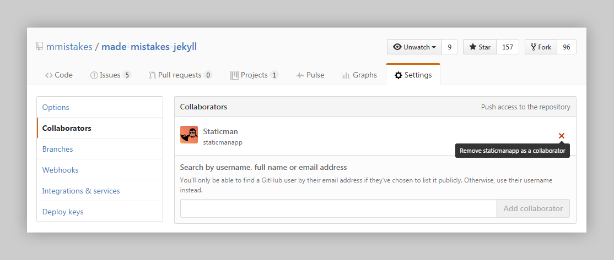
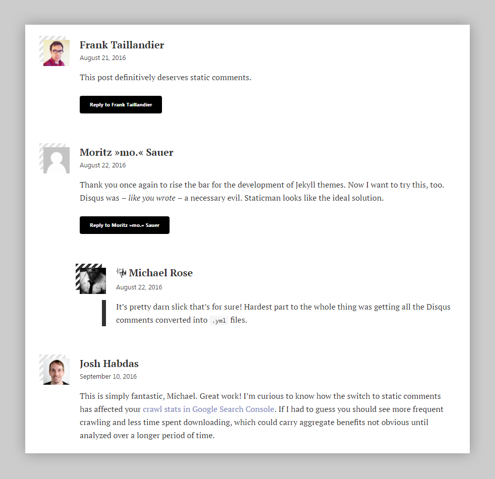
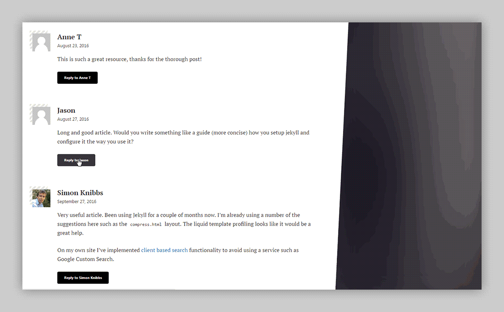
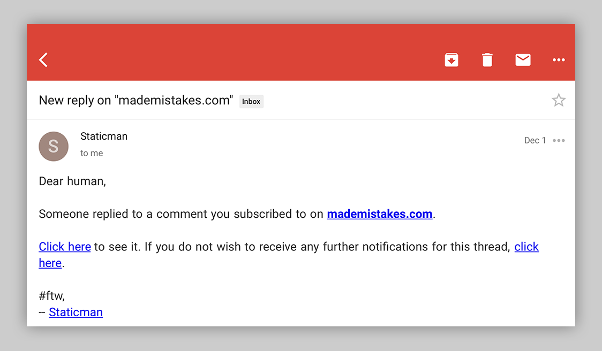

In the months after ditching Disqus for a [static-based commenting system](), [**Staticman**](https://staticman.net/) has matured with feature adds like *threaded comments* and *email notifications*.

Armed with instructions provided by Eduardo Bouças in [this GitHub issue](https://github.com/eduardoboucas/staticman/issues/42 "Email notification upon replies"), I set off to level-up the commenting experience on **Made Mistakes**. Here's how I did it.

## Upgrade to Staticman v2

To take advantage of the new features, it was necessary to migrate Staticman settings from Jekyll's `_config.yml` file into a new `staticman.yml` file[^staticman-yml]. None of the parameter names changed making the transition to `v2` that much easier.

[^staticman-yml]: An added benefit of the new configuration file means you can use Staticman with other static site generators. `v2` no longer requires you to use a Jekyll specific `_config.yml` file.

```yaml
comments:
  allowedFields     : ['name', 'email', 'url', 'message']
  branch            : "master"
  commitMessage     : "New comment."
  filename          : "comment-{@timestamp}"
  format            : "yaml"
  moderation        : true
  path              : "src/_data/comments/{options.slug}"
  requiredFields    : ['name', 'email', 'message']
  transforms:
    email           : md5
  generatedFields:
    date:
      type          : "date"
      options:
        format      : "iso8601"
```

[[notice | New configuration options ]]
| Be sure to check the [sample configuration file](https://github.com/eduardoboucas/staticman/blob/master/staticman.sample.yml) and [full list of parameters](https://staticman.net/docs/configuration) for setup ideas.
|
| For example you can configure multiple properties (comments, reviews, and other types of user-generated content), change commit message and request body text, enable email notifications, and much more from a `staticman.yml` file.

### Remove/add Staticman as a collaborator

I'm not entirely sure if doing the following was necessary. I encountered errors when submitting test comments and this appeared to solve the problem. It's possible I mis-configured something else and that was the real issue...

Either way, let me know about your experience upgrading from Staticman `v1` to `v2` in the comments below.

1. Revoked collaboration rights for Staticman `v1` by removing from my GitHub repository.
   
2. Added Staticman back as [collaborator](#setting-up-staticman).
3. Pinged the version 2 endpoint `https://api.staticman.net/v2/connect/{your GitHub username}/{your repository name}` to accept the collaboration invitation.

### Update POST endpoint in comment form

To `POST` correctly to Staticman, the `action` attribute in my comment form needed a small update. Changing `v1` to `v2` in [**_includes/page__comments.html**](https://github.com/mmistakes/made-mistakes-jekyll/blob/f0074b7b9e64b6d4b63dd13a371cedc576dae49d/src/_includes/page__comments.html#L34) and appending `/comments`[^property] to the end did the trick for me.

```html
<form id="comment-form" class="page__form js-form form" method="post" action="https://api.staticman.net/v2/entry/{{ site.repository }}/{{ site.staticman.branch }}/comments">
```

[^property]: Site properties are optional. See Staticman documentation for details on [hooking up your forms](https://staticman.net/docs/#step-3-hook-up-your-forms).

## Add support for threaded comments

Getting nested comments working was a big pain point for me. Numerous Liquid errors, trying to wrap my head around `for` loops inside of other `for` loops, array filters that broke things, and more --- took me a bit to figure out.

### Add "replying to" identifier

To properly nest replies I needed a way of determining their hierarchy. I went with a field named `replying_to` and added it as an `allowedField` to my Staticman config file:

```yaml
allowedFields: ["name", "email", "url", "message", "replying_to"]
```

And to my comment form as a hidden field:

```html
<input type="hidden" id="comment-parent" name="fields[replying_to]" value="">
```

[[notice | Update: field name change ]]
| After publishing this article I learned that [`options[parent]`](https://github.com/eduardoboucas/staticman/issues/42#issuecomment-262938831) is meant to identify subscription entries, and not comment lineage. I've since changed to `fields[replying_to]` and updated the article and sample code to reflect this.

### Update Liquid loops

To avoid displaying duplicates, I needed to exclude replies and only top level comments in the main loop. This seemed like the perfect use-case for Jekyll's `where_exp` filter:

[[notice | Where expression Jekyll filter]]
| Select all the objects in an array where the expression is true. Jekyll v3.2.0 & later. **Example:** `site.members | where_exp: "item", "item.graduation_year == 2014"`

If the hidden `fields[replying_to]` field I added to the form was working properly I should have comment data files similar to these:

#### Parent comment example

```yaml
message: This is parent comment message.
name: First LastName
email: md5g1bb3r15h
date: '2016-11-30T22:03:15.286Z'
```

#### Child comment example

```yaml
message: This is a child comment message.
name: First LastName
email: md5g1bb3r15h
replying_to: '7'
date: '2016-11-02T05:08:43.280Z'
```

As you can see above, the "child" comment has `replying_to` data populated from the hidden `fields[replying_to]` field in the form. Using this knowledge I tested against it using `where_exp:"comment", "comment.replying_to == blank"` to create an array of only "top-level" comments.

```liquid


  
  
  
  
  
  
  

```





[[notice | Note: `sort` and `where` filters don't mix]]
| I ran into strange behaviors and errors due to mixing a `sort` filter with `where` and `where_exp`. Came to the conclusion it was unnecessary as the items were already being sorted alphabetically based on their filenames, and removed the filter.
|
| I'm using the following: `filename: \"comment-{@timestamp}\"` structure. Your mileage may vary depending on how you name entries.

[[notice | Note: added back `sort` filter]]
| Not exactly sure if it's a filesystem or OS thing, but building my site with Travis CI shuffled the order of comments. Applying `sort` to the `comments` assign was necessary to get everything in the correct chronological order.

#### Displaying nested comments

Here is what I was looking to accomplish... before the headaches started :anguished: :gun:

- Start a loop and on each iteration create a new array named `replies` of only reply comments.
- Evaluate the value of `replying_to` in these replies.
- If `replying_to` is equal to the index of the parent loop then it's a child and should be treated as one.
- If not, move on to the next entry in the array.
- Rinse and repeat.

I determined the easiest way of assigning a unique identifier to each parent comment would be sequentially. Thankfully Liquid provides a way of doing this with `forloop.index`.

```liquid

```

[[notice | Universally unique identifier]]
| I realize an index based unique identifier isn't the smartest way to go about this. I have a mix of comment data migrated from Disqus and pre Staticman generating UUIDs as `_id` variables, so this made sense. YMMV.

*[YMMV]: Your mileage may vary

Next I nested a modified copy of the "top-level comment" loop from before inside of itself --- to function as the "child" or `replies` loop.

```liquid
{{ include.index }}


  
  
  
  
  
  
  
  
  

```

Unfortunately the `where_exp` filter proved troublesome yet again, causing Jekyll to error out with: `Liquid Exception: Liquid error (line 47): Nesting too deep in /_layouts/page.html`.

After brief thoughts of the movie **Inception**, I applied an `inspect` filter to help troubleshoot the `replies` loop. I determined that the `where_exp` condition was failing[^integer-string] because I was trying to compare an integer against a string :flushed:.

[^integer-string]: `15` is not the same as `'15'`. Those single quotes make a world of difference...

To solve this I placed a `capture` tag around the index variable to convert it from an integer into a string. Then modified the `where_exp` condition to compare `replying_to` against this new `{{ i }}` variable --- fixing the issue and allowing me to move on.

```liquid
{{ include.index }}

```

#### `_includes/page__comments.html`

```html
<section class="page__reactions">
  
    
      <!-- Start static comments -->
      <div id="comments" class="js-comments">
        <h2 class="page__section-label">
          
            {{ site.data.comments[page.slug] | size }}
          
          Comments
        </h2>
        
        
          
          
          
          
          
          
          
          
          
        
      </div>
      <!-- End static comments -->
    

    
      <!-- Start new comment form -->
      <div id="respond">
        <h2 class="page__section-label">Leave a Comment <small><a rel="nofollow" id="cancel-comment-reply-link" href="{{ page.url | absolute_url }}#respond" style="display:none;">Cancel reply</a></small></h2>
        <form id="comment-form" class="page__form js-form form" method="post" action="https://api.staticman.net/v2/entry/{{ site.repository }}/{{ site.staticman.branch }}/comments">
          <fieldset>
            <label for="comment-form-message"><strong>Comment</strong> <small>(<a href="https://kramdown.gettalong.org/quickref.html">Markdown</a> is allowed)</small></label>
            <textarea type="text" rows="6" id="comment-form-message" name="fields[message]" required spellcheck="true"></textarea>
          </fieldset>
          <fieldset>
            <label for="comment-form-name"><strong>Name</strong></label>
            <input type="text" id="comment-form-name" name="fields[name]" required spellcheck="false">
          </fieldset>
          <fieldset>
            <label for="comment-form-email"><strong>Email</strong> <small>(used for <a href="http://gravatar.com">Gravatar</a> image and reply notifications)</small></label>
            <input type="email" id="comment-form-email" name="fields[email]" required spellcheck="false">
          </fieldset>
          <fieldset>
            <label for="comment-form-url"><strong>Website</strong> <small>(optional)</small></label>
            <input type="url" id="comment-form-url" name="fields[url]"/>
          </fieldset>
          <fieldset class="hidden" style="display: none;">
            <input type="hidden" name="options[origin]" value="{{ page.url | absolute_url }}">
            <input type="hidden" name="options[parent]" value="{{ page.url | absolute_url }}">
            <input type="hidden" id="comment-replying-to" name="fields[replying_to]" value="">
            <input type="hidden" id="comment-post-id" name="options[slug]" value="{{ page.slug }}">
            <label for="comment-form-location">Leave blank if you are a human</label>
            <input type="text" id="comment-form-location" name="fields[hidden]" autocomplete="off">
          </fieldset>
          <!-- Start comment form alert messaging -->
          <p class="hidden js-notice">
            <span class="js-notice-text"></span>
          </p>
          <!-- End comment form alert messaging -->
          <fieldset>
            <label for="comment-form-reply">
              <input type="checkbox" id="comment-form-reply" name="options[subscribe]" value="email">
              Notify me of replies by email.
            </label>
            <button type="submit" id="comment-form-submit" class="btn btn--large">Submit Comment</button>
          </fieldset>
        </form>
      </div>
      <!-- End new comment form -->
    
      <p><em>Comments are closed. If you have a question concerning the content of this page, please feel free to <a href="/contact/">contact me</a>.</em></p>
    
  
</section>
```

#### `_includes/comment.html`

```html
<article id="comment{{ index | prepend: '-' }}{{ include.index | prepend: '-' }}" class="js-comment comment admin child">
  <div class="comment__avatar">
    
      
    
      
    
      
    
  </div>
  <h3 class="comment__author-name">
    
      <a rel="external nofollow" href="{{ include.url }}">
        <svg class="icon" width="20px" height="20px"><use xlink:href="#icon-mistake"></use></svg> {{ include.name }}
      </a>
    
      <svg class="icon" width="20px" height="20px"><use xlink:href="#icon-mistake"></use></svg> {{ include.name }}
    
  </h3>
  <div class="comment__timestamp">
    
      <a href="#comment{{ index | prepend: '-' }}{{ include.index | prepend: '-' }}" title="path to this comment">
      <time datetime="{{ include.date | date_to_xmlschema }}">{{ include.date | date: '%B %d, %Y' }}</time>
      </a>
    
  </div>
  <div class="comment__content">
    {{ include.message | markdownify }}
  </div>
  
    <div class="comment__reply">
      <a rel="nofollow" class="btn" href="#comment-{{ include.index }}" onclick="return addComment.moveForm('comment-{{ include.index }}', '{{ include.index }}', 'respond', '{{ page.slug }}')">Reply to {{ include.name }}</a>
    </div>
  
</article>

{{ include.index }}


  
  
  
  
  
  
  
  
  

```

### Comment reply HTML and JavaScript

Next up was to add some finishing touches to pull everything together.

Familiar with the way [**Wordpress**](https://wordpress.org/) handles reply forms I looked to it for inspiration. Digging through the JavaScript in [`wp-includes/js/comment-reply.js`](https://core.svn.wordpress.org/trunk/wp-includes/js/comment-reply.js) I found everything I could possibly need:

- `respond` function to move form into view
- `cancel` function to destroy a reply form a return it to its original state
- pass parent's unique identifier to `fields[replying_to]` on form submit

To start I used an `unless` condition to only show reply links on "top-level" comments. I only planned on going one-level deep with replies, so this seemed like a good way of enforcing that.

```html

  <div class="comment__reply">
    <a rel="nofollow" class="btn" href="#comment-{{ include.index }}">Reply to {{ include.name }}</a>
  </div>

```





To give the **reply link** life I added the following `onclick` attribute and [JavaScript](https://github.com/mmistakes/made-mistakes-jekyll/blob/49632d19977e341b51c91dad8e71bf6ef88e79c3/src/assets/javascripts/main.js#L84-L181) to it.

```javascript
onclick="return addComment.moveForm('comment-{{ include.index }}', '{{ include.index }}', 'respond', '{{ page.slug }}')"
```

A few minor variable name changes to Wordpress' `comment-reply.js` script was all it took to get everything working with my `form` markup.





## Add support for email notifications

Compared to nesting comment replies, email notifications were a breeze to setup.

### Update `staticman.yml` configuration

To ensure that links in notification emails are safe and only come from trusted domains, set `allowedOrigins` accordingly. 

**Example:**

```yaml
allowedOrigins: ["mademistakes.com"]
```

The domain(s) allowed here must match those passed from an `options.origin` field we're going to add in the next step. Only domains that match will trigger notifications to send, otherwise the operation will abort.

[[notice | ProTip: use your own Mailgun account]]
| The public instance of Staticman uses a [**Mailgun**](http://www.mailgun.com/) account with a limit of 10,000 emails a month. You are encouraged to create an account and add your own [Mailgun API and domain](https://staticman.net/docs/configuration#notifications.enabled) to `staticman.yml`. Be sure you encrypt both using the following endpoint: `https://api.staticman.net/v2/encrypt/{TEXT TO BE ENCRYPTED}`.

### Update comment form

To finish, add the following three fields to the comment `form`. 

**Field 1 + 2:** Hidden input fields that pass the `origin`[^origin] set in `staticman.yml` and unique identifier to the entry the user is subscriber to:

```html
<input type="hidden" name="options[origin]" value="{{ page.url | absolute_url }}">
<input type="hidden" name="options[parent]" value="{{ page.url | absolute_url }}">
```

**Field 3:** A checkbox `input` for subscribing to email notifications.

```html  
<label for="comment-form-reply">
  <input type="checkbox" id="comment-form-reply" name="options[subscribe]" value="email">
  Notify me of new comments by email.
</label>
```

Nothing fancy here, `name=options[subscribe]` and `value="email"` are added to the field to associate subscription data with email address.

[^origin]: This URL will be included in the notification email sent to subscribers, allowing them to open the page directly.

If setup correctly a user should receive an email anytime a new comment on the post or page they subscribed to is merged in.





---

Well there you have it, a static-based commenting system done up in Jekyll that handles nested comments and reply notifications. Now if I could only shave a minute of my build time to get new comments merged in quicker :frowning:.

*[CSS]: Cascading Style Sheets
