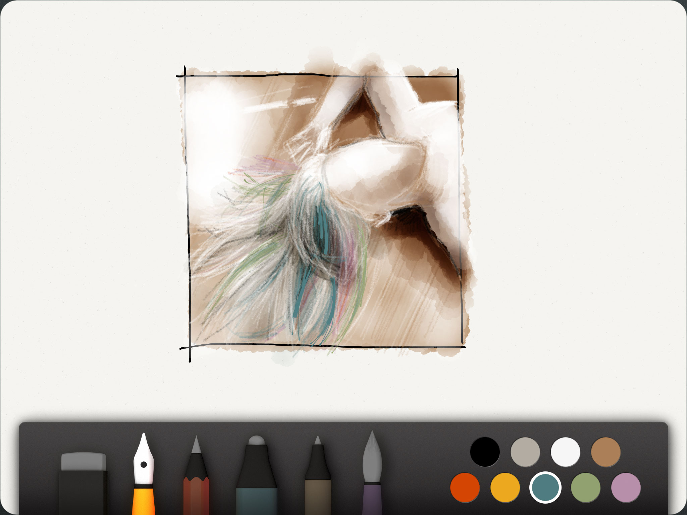
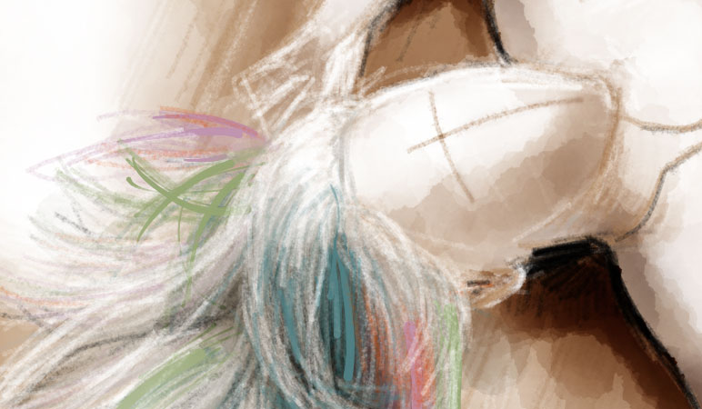

I hate cutting the grass because it's a chore, and chores suck. [Drawing a portrait every day](/notes/paperfaces-ipad-portrait-project/) for the last 10 months could have turned into a royal chore, but I kept it fun by setting a few restraints. These restrictions had a big effect on my style and time investment. Not exactly the most busy dude in the world, but working full time, tinkering with side projects, finding time for [my wife](https://2littlerosebuds.com/ "2 Little Rosebuds"), and helping to raise my twin girls doesn't leave much open.

[Download a Drawing PaperFaces Guide](../../images/paperfaces-portrait-cheatsheet.jpg)

*I can't draw and I'm not an artist* --- that's the real reason most of my [PaperFaces illustrations](/paperfaces/) don't have facial features. Capturing a likeness is tough business yo! Omitting the trickiest part (the face) frees up all kinds of time, which circles back to how I've been able to maintain a daily drawing rhythm. A technically precise illustration that might have taken 8 hours is now squashed down to 30--60 minutes. Half an hour is fun, 10 hours is a chore!

Brevity is at the heart of every one of my portraits. *Can't draw facial features well?* Imply a face with intersecting lines that cross the face instead. *Don't have time to shade and blend skin tones?* Paint a few strategically placed gray blobs instead. *Can't wrap your head around drawing realistic hair?* Drop some black ink and pencil over it with brown for an effect that is sure to wow your mom.

Still confused? Here are the general steps I follow for every portrait I draw. Don't worry if you're just starting out --- almost anything you create with Paper by 53 will look beautiful. Just experiment with the tools and have fun with your journey --- the rest will come naturally.

## Shape the canvas

I decided on a square frame for [my project](/paperfaces/ "PaperFaces iPad Portrait Project"), but you might want to experiment with the shape and canvas placement to better suit your needs. I like to draw the frame freehand with black ink to give it character, but you can use pencil if you want to hide it easier.

[[notice | ProTip: create a template]]
| Don't want to bother drawing the same frame each time? Then make a template of it that you can copy at will. To do this: draw the frame or whatever else you want on all your pages, pinch the page to zoom out, tap and hold on the (+) until the *duplicate button* appears, then tap that. Now you're free to move this new page around, copy it to another sketchbook, or duplicate it again.

## Apply a background

<figure class="two-column">
  
  
  <figcaption>
Paint from light to dark with watercolors and add detail with a pencil.
</figcaption>
</figure>

Typically, I spend way more time drawing or painting the background. No one is going to notice if a wall or some tree doesn't match the original --- they're way more forgiving than a mouth or nose. Adding detail here instead of the face adds a sense of tension that I quite enjoy.

Whether I'm working on clouds, a landscape, or a face, I follow the same process:

1. Rough blobs of watercolor to define major shapes.
2. Layer shape after shape after shape with watercolor until dark and opaque.
3. Add detail with a pencil.
4. Layer even more watercolor strokes over the pencil.
5. Finish with the pencil to cleanup edges or apply highlights and shadows.

## Ghost the face

The background should be nice and heavy now. Using a white pencil, outline the face or blob it out with watercolor instead. On the rare chance the background is really light, use flesh tones (light brown/pink/orange) instead. The marker or fountain pen are appropriate for face lightening, but you can't layer them as much. Watercolor allows you to progressively lighten and soften edges, which helps enhance the realism.

<figure class="three-column">
  
  
  
  <figcaption>
Use white to outline and lighten the figure's shape or face.
</figcaption>
</figure>

A white mixed with a hint of orange or yellow works great too. Experiment with the amount of color you mix because if you add too much the opaque nature of white is removed and it won't "erase" the background beneath.

## Build up the face

The trick here is to gradually apply smooth layers of a light color using the watercolor brush. First few layers are to fill the entire face with whatever skin color you're trying to match. For areas that are in shadow, mix in a dull (almost gray) red or blue and then quickly paint half of the face. Shape really matters --- if you don't get it right just two finger rewind and try again. Move fast and avoid lingering in one spot to keep your edges soft and avoid going too dark.

<figure class="two-column">
  
  
  <figcaption>
Move quick and deliberate with watercolor.
</figcaption>
</figure>

## Pencil in details

Same deal as the background, select the pencil tool and start refining edges that are deep in shadow (hair line, necks, clothing, etc). This will help tighten things up and fix the less than precise strokes of watercolor you laid down earlier. 

Now is a great time to pencil in the hair, mustache, or beard whiskers using black as your base and a bright brown or yellow over the top. For a detailed Paper by 53 hair tutorial, [check this out](/mastering-paper/drawing-hair/) one time.

## Imply facial features

To finish the face take care to observe the direction and tilt of the head. Carefully draw a line from the forehead down to where the lips should be, following the same curve of your subject. You could keep it really straight, but I find following this natural curve helps make it look more three-dimensional. For the horizontal line, make it eye to eye in length. A fun tip for exaggerating what a face might be looking at --- extending the horizontal line off the face and into the background on one side.

[[notice | Mastering Paper Tutorials]]
| Since publishing this short guide I've gone through several iPad styli and written numerous tutorials expanding on the techniques described above. Be sure to check out my [**Mastering Paper by FiftyThree series**](/mastering-paper/) to learn the latest ways I'm using the app and tools to create realistic portraits and other pieces of art. 
