Paper by FiftyThree makes painting realistic skies and clouds a breeze. If you had fun drawing trees, just wait until you fluff out happy clouds that would make Bob Ross proud. Honestly, with just a few washes of watercolor and strokes of pencil, you'll have an instant masterpiece. Here...let me show you how.

## Blue skies fade

Let's start with the easier of the two, a nice bright blue sky. One of the more important steps is choosing a blue to paint with. The hue...the saturation...and the brightness all play a role in the overall emotion of the piece. I tend to mix in a swirl of green and keep it slightly over saturated to contrast against skin tones as seen in my many [PaperFaces portraits](/paperfaces/). If you're going for doom and gloom, back off the blue and mix in gray instead to set the foundation for an overcast sky.


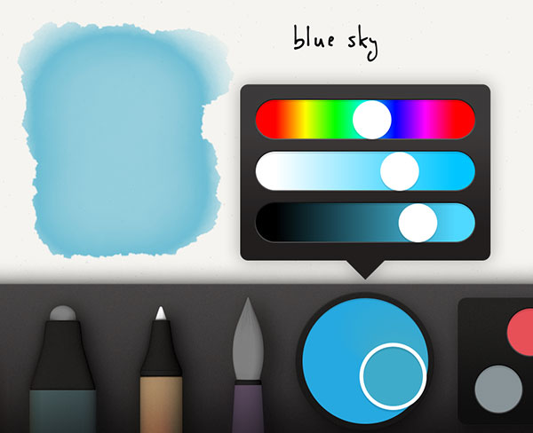
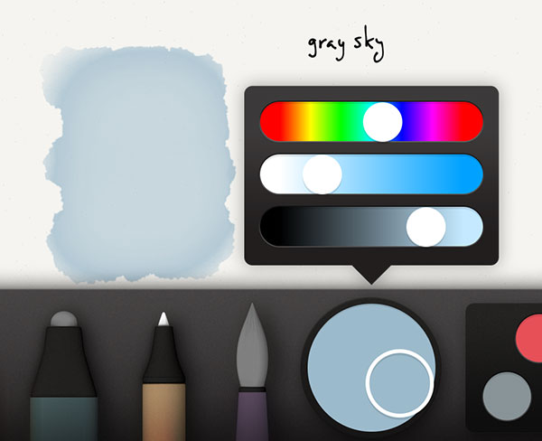


With the base sky color mixed, select the pencil tool and draw a line across the screen to represent the horizon. This step isn't always necessary, so if you're a pro and don't need the help of a guide feel free to move on.

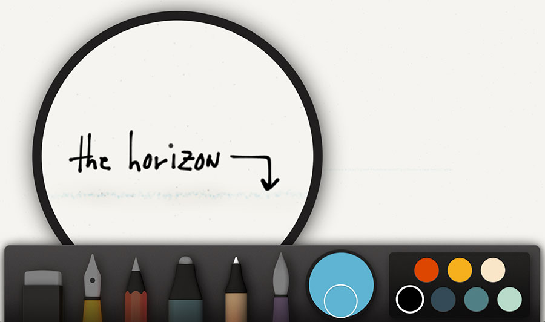

### Watercolor base coat

Prep work complete, now you can start the actual painting of the sky. What you're trying to accomplish with this step is a smooth coat that gradually fades to white as you approach the horizon line. The easiest way to do this is with the watercolor brush, starting from the top of the composition, working down in a slight zig zag pattern.


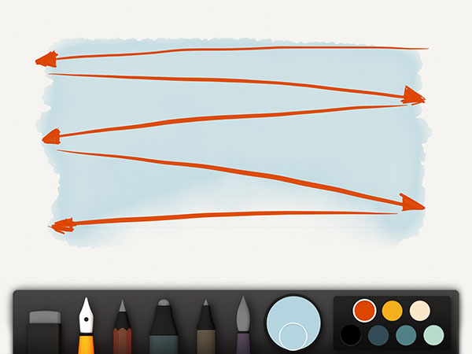
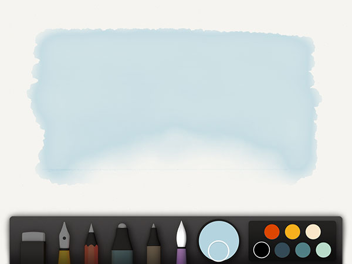


When painting, do not lift the stylus or your finger from the screen until you finish this first coat. The trick is to move very slow near the top, and progressively speed up the zig zag pattern as you approach the horizon line. Depending on how gradual of a fade you want in the sky, multiple coats may be required. Follow the same pattern from before to keep everything looking smooth.


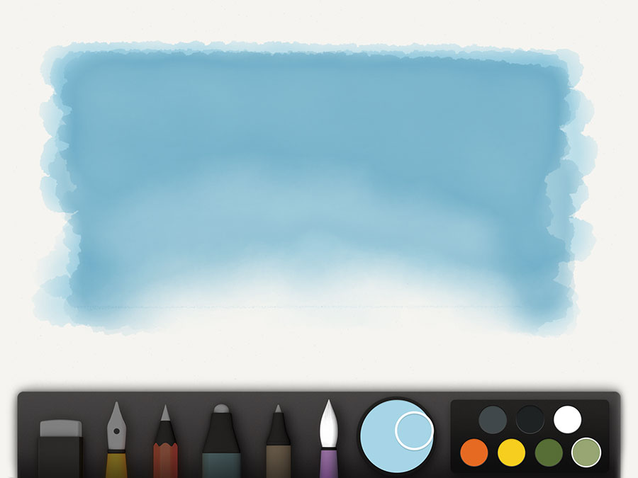


### Painting puffy clouds

Now comes my favorite part, painting happy clouds ala Bob Ross[^1]. Sticking with the watercolor brush, we're going to fluff a few clouds in using short circular strokes. If you have a [Pogo Connect Smart Pen](), you can control the amount of background lightening easier. But if you don't, just focus on making quick strokes --- the faster the better. 

[[notice | ProTip: go easy on the white]]
| White lightens quickly and you don't want to remove too much blue at once, so be careful with this step. If you remove too much, just rewind and try again.


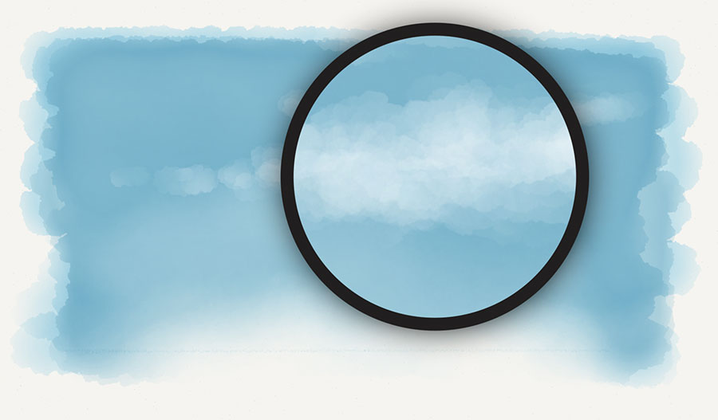


With the clouds shaped and looking like clumps of cotton, it's time to add a few wispy cirrus clouds and clean the edges up. Again, a [Pogo Connect Smart Pen](http://www.amazon.com/gp/product/B009K448L4/ref=as_li_ss_tl?ie=UTF8&camp=1789&creative=390957&creativeASIN=B009K448L4&linkCode=as2&tag=mademist-20) comes in handy, allowing you to work lightly and gradually. Finger painters and normal stylus creators fear not, quick strokes can achieve the same results.

No need to overdo it with the wisps, just a few light crosshatches is all that's needed. For those longer streaky clouds your pencil strokes should be longer and more horizontal. I usually stick with just a pencil to create these wisp textures, but if you're feeling adventurous a light touch of white watercolor can be used to finish them off.





Don't be afraid to go back into the clouds with the blue color we initially painted the sky with. The same "streaky" pencil pattern used to draw wisps (see above) can be used to add subtle cloud shadows. I often flip flop between blue and white to get the detail just right.





## Sunsets and fire skies

To paint a sunset, I use the same exact techniques and process. The only difference is the addition of three to four colors to create all the sunset fades and multi-colored clouds.

Fiery red skies and silhouetted foreground subjects look super dramatic, so that's what I'm going to demonstrate in the following steps. Remember, color is extremely subjective, I'm merely showing a few examples to get you started. Feel free to experiment and vary them up --- there is no right or wrong here.

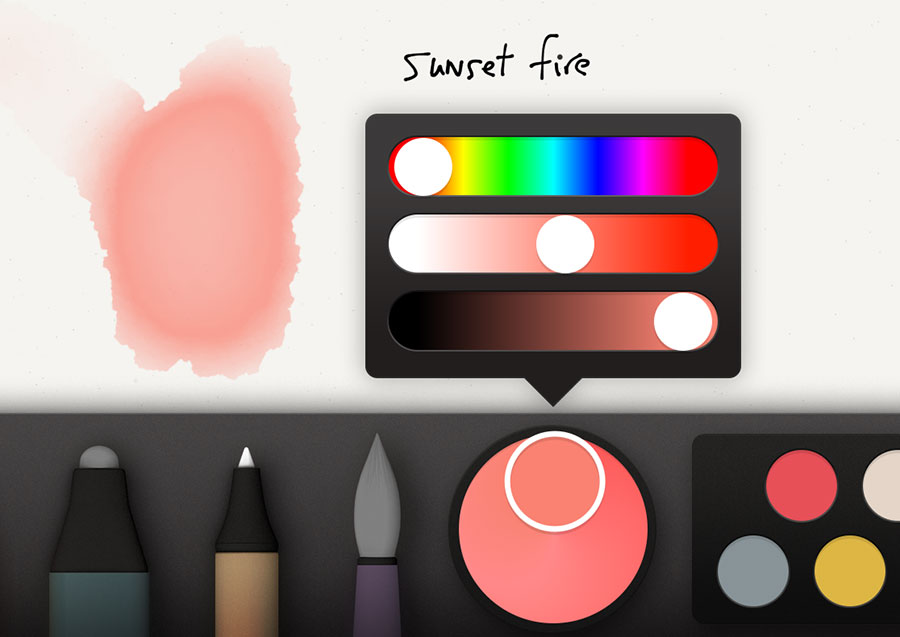

We'll start by mixing orange into red and then draw a light line at the sky's horizon to act as our guide. Select the watercolor brush and apply paint from the horizon line up --- in the opposite direction from before. Remember the zig zag pattern we used earlier to paint a blue sky? Good. Because it's going to come in handy here.

Just like the blue sky from before, paint slowly from left to right, slightly overlapping the row before without lifting your pen or finger. As you approach the top of the sky move faster to fade the color into the background.

### Gradations of color

A few coats to build up the sky into a smooth gradation of color may be necessary. What you're looking for is a darker red at the horizon, that gradually fades into the background about halfway up from the top. I fade the red around halfway to leave room to fade a dark blue-violet down from the top in this next step.

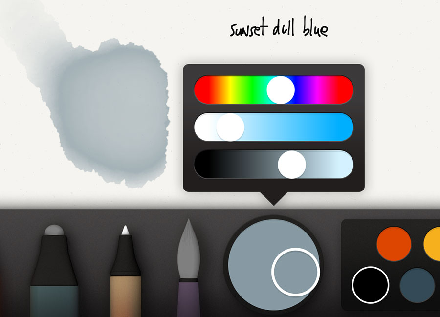

After you're satisfied with the red coat, mix a dull and dark blue gray to paint the other half of the sunset. Use the same zig zag painting pattern, only this time start in the upper left corner and work your way down. As you approach the faded red, paint faster to fade into the background just before it, leaving about an inch of background between.


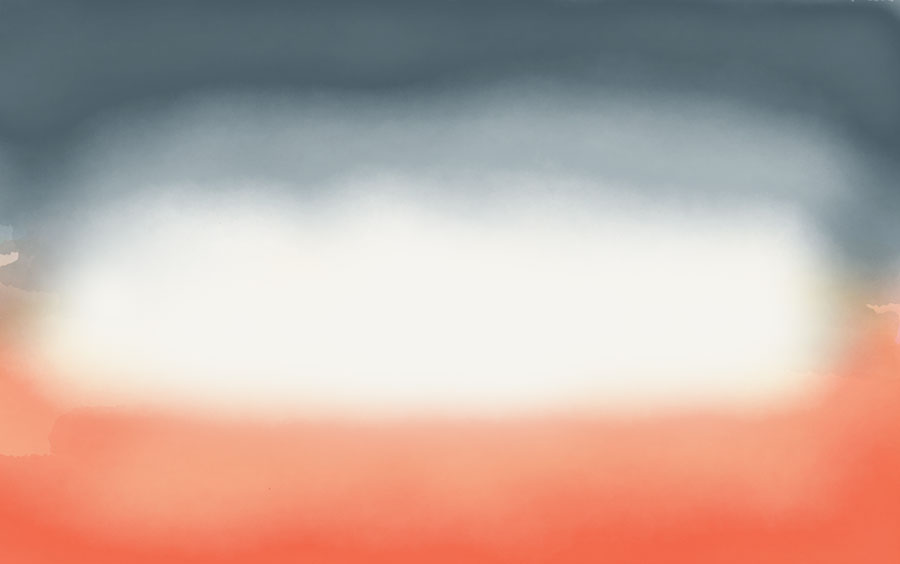


You could leave the sunset washes as is and proceed to drawing clouds, but if you want to add even more drama to the sunset, apply a thin wash of yellow. I like to mix a creamy color like so:

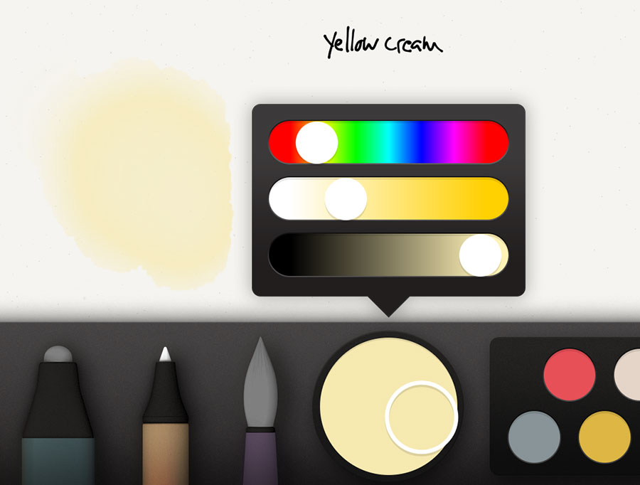

And paint a light coat over the red, background area in the middle, and gradually fade into the blue.

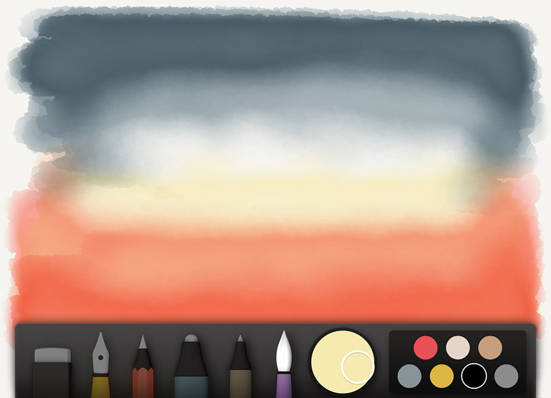 

[[notice | ProTip: speed matters]]
| Paint faster as you approach the blue wash to avoid turning it into a green color. Yellow and blue make...

### Sunset clouds

To add clouds to our sunset let's start by mixing a red into white. You want a pink color that has just enough white in it to lighten while you paint --- some trial and error may be necessary to get the mix right. Once you successfully mixed a pink, fluff in a few clouds using short circular strokes (same technique used in the blue sky).

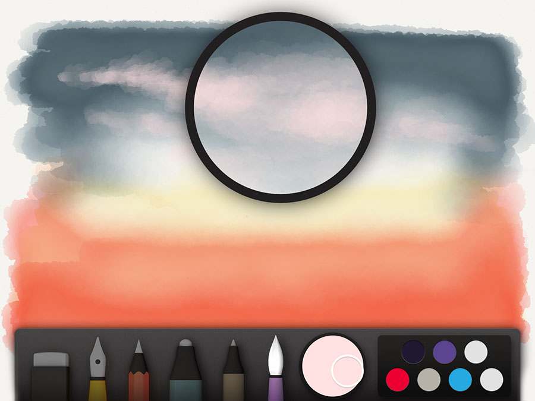

Giving these clouds depth and dimension can be achieved by adding a little more red to the mix. You're looking to add just enough to make the color translucent instead of opaque. A few strokes is all that's needed when applying red tinted shadows to the clouds. 


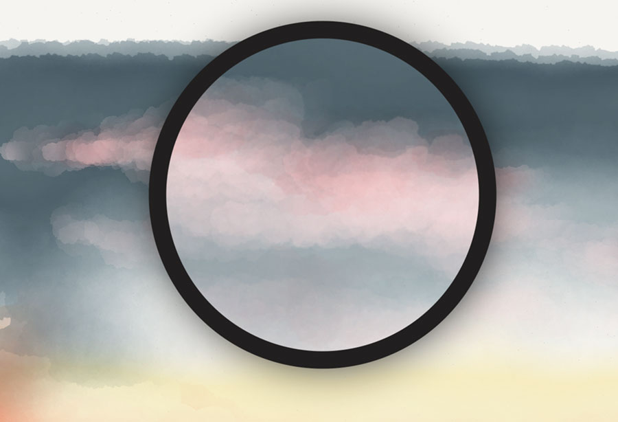


[[notice | ProTip: find the right mix]]
| If you don't add enough red to the color mix, the watercolor brush will lighten the cloud instead of darkening it.

A pencil filled with a pinkish red is also perfect for refining clouds edges or drawing in long wispy clouds.


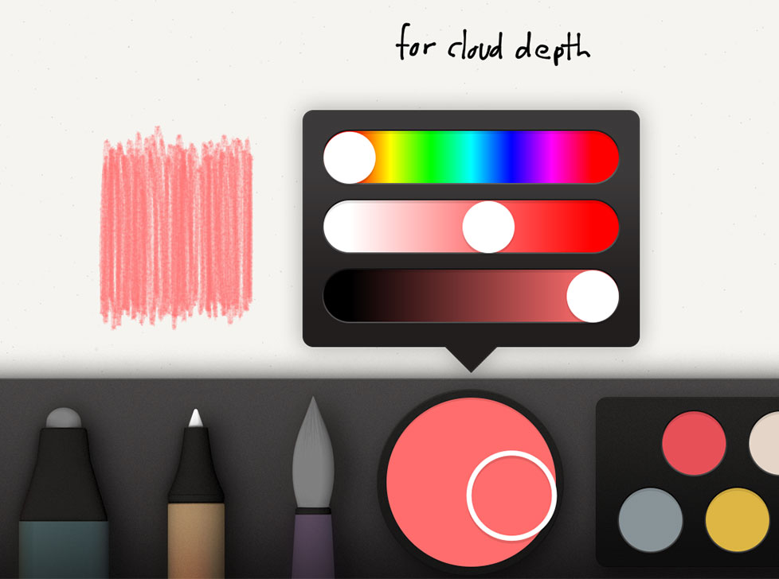
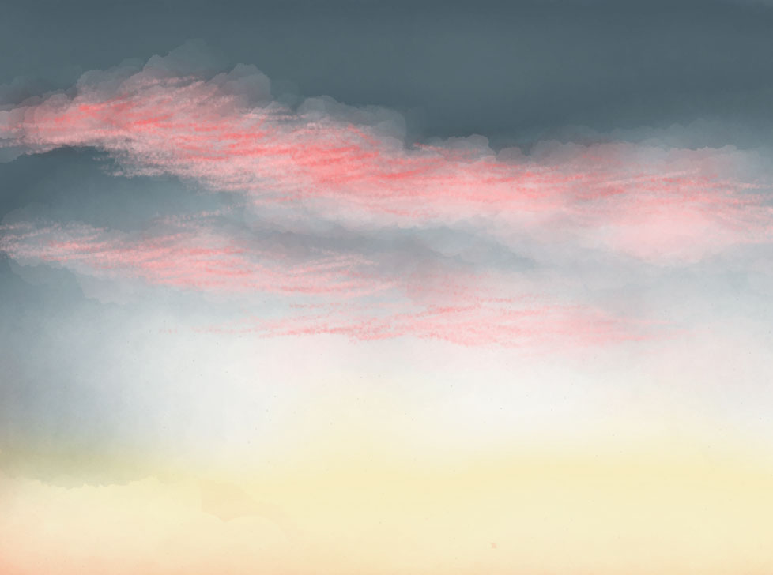


An added benefit of painting a sunset, is how it reacts with objects that are placed in silhouette. You can draw or paint almost anything and fill it with a dark color to add drama to your creation. The outline of a figure in the foreground, hills and mountain tops, or a half circle at the horizon to represent an eclipsed sun are all appropriate choices.

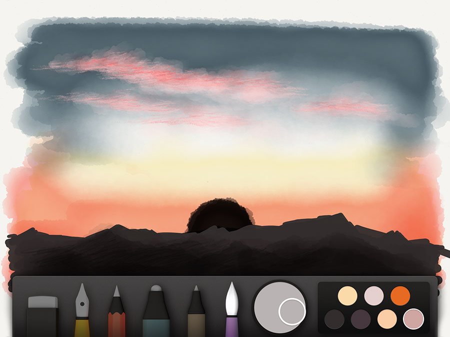

## Variations on a theme

Using all of these techniques I was able to create a variety of backdrops for the portraits in my [PaperFaces Project](/paperfaces/). Below are a few finished skies and clouds to show what is possible just by varying the color and composition.

<ul class="gallery-thumbnails">
  <li></li>
  <li></li>
  <li></li>
  <li></li>
  <li></li>
  <li></li>
  <li></li>
  <li></li>
</ul>

---

Next up --- the perfect landscape compliment to happy trees and clouds, crashing waves and water.

[^1]: Watching Bob Ross paint on his PBS show, [**The Joy of Painting**](http://en.wikipedia.org/wiki/The_Joy_of_Painting) was a huge influence on me during my high school years. Many of the techniques I use to paint with Paper by 53 have been adapted from him. RIP in you silly son of a gun.
