Sorry for the delay in publishing the next installment of my **Mastering Paper Guide** --- between the twins and my day job, I've had my hands full this summer. But enough of all the excuses, let's get right into it OK?

## Drawing trees

When I draw trees I select the watercolor brush and jump right in, using one continuous stroke to rough out a general shape. Don't worry about being precise here, we'll refine the edges later. You could start with a light pencil sketch to nail your the composition, but I usually don't --- it keeps the tree feeling organic and less rigid (a happy accident is your friend).

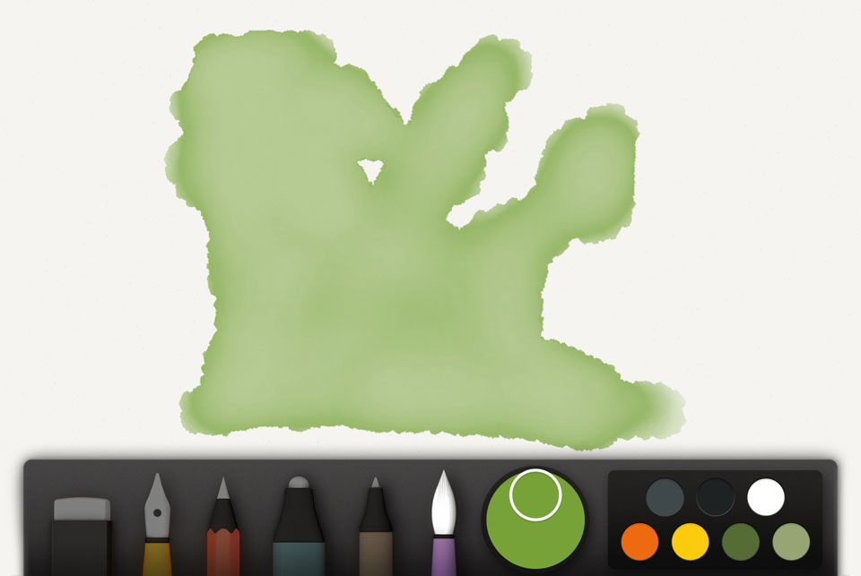

[[notice | ProTip: build up tones by layering]]
| When using the watercolor brush, try and mix a color around 50--75% lighter than the desired color. This lighter color allows you to layer multiple coats to create a nice vivid color. Going dark right away usually makes shapes flat and lifeless, with color that lacks richness.

Building up a color with multiple layers usually yields better results than one dark glaze.

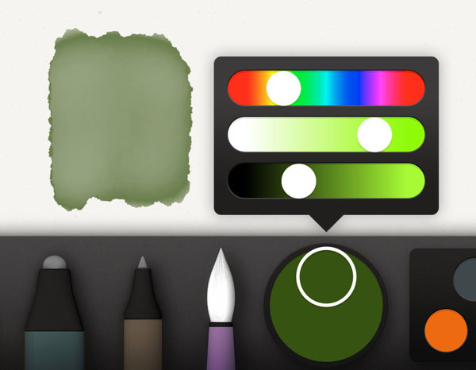

[[notice | ProTip: painting with the brush]]
| Remember the watercolor brush is translucent and no matter what color you pick it won't match without a few coats.

Here are some of my favorite colors to get you started painting leaves:

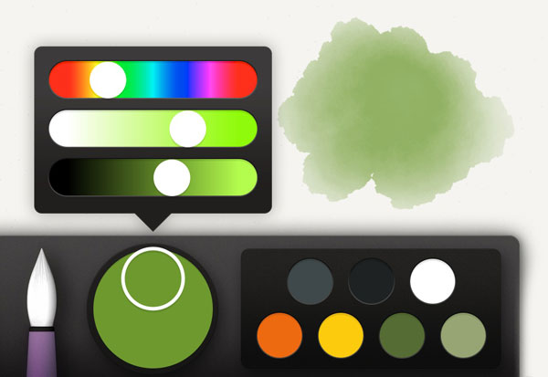

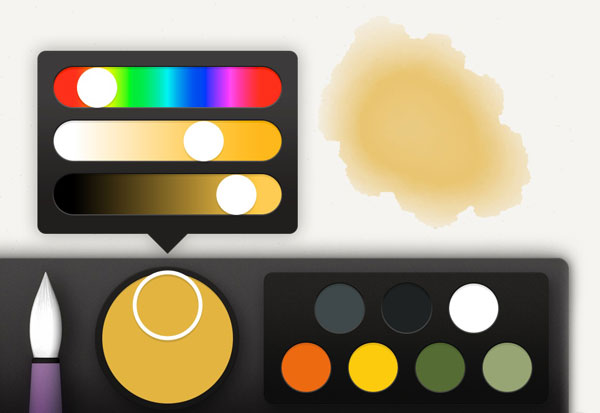

Once you're happy with the general shape of the tree, it's time to add some shadows. You can continue to use the same base color from before or darken it up depending on how much shadow you have to color. What I like to do is make short strokes to create a blotchy texture. For you traditional painters out there, it's kind of like scumbling, only we're not scraping paint around with a dry brush.

The primary goal here is to give the illusion of leaf clusters and indicate where the branches and trunk flow. [FiftyThree's Pencil](/mastering-paper/pencil-53-review/) or a [Pogo Connect Smart Pen](/mastering-paper/pogo-connect-smart-pen/) can help immensely to paint branches of varying widths --- an ability no other styli support when used with Paper by 53.

<figure>
  
  <figcaption>
A fast way to create leaves is to make short quick strokes with the watercolor brush.
</figcaption>
</figure>

Now it's time to start adding detail to the tree with highlights. Using a reference photo can help determine a good highlight color, but if you don't have one check below for my favorite mixes. Stay away from colors that are too white --- you want a color that is still in the family of your base color, just warmed and lightened.

[[notice | ProTip: mixing leaf highlights]]
| 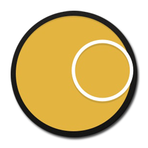
| If you're having trouble mixing a highlight I like to start with a green from the leaf's base, and add yellow. Yellow with orange mixed in also makes for a nice leaf highlight --- note the example on the left.

With our highlight color mixed, select the pencil tool and start lightly sketching small "scratchy" marks over the base coat. The more times you go over a pencil stroke, the more intense the color will get. Try not to overwork one area with the pencil, the key is to keep everything harmonious.

[[notice | ProTip: pencil in highlights]]
| Apply highlight strokes on dark shadows to define individual leaves or groupings. A well placed pencil highlight can go a long way in adding texture and realism to your art.

<figure>
  
  <figcaption>
For a more textured look use the pencil tool instead of the fountain or ink pens.
</figcaption>
</figure>

At this point your tree is pretty much done --- it really depends on how much detail you think it needs. If this tree is the primary subject of your composition then you probably want to work it some more and sharpen the edges. If it's just background filler I'd suggest keeping it soft and blurry so it doesn't compete with whatever you're placing in the foreground.

For extra detail grab the base green from before, and mix in some brown and black, for a nice dark color. Armed with a pencil, use this color to add branches, and refine edges. If you overworked areas with highlights earlier, this darker color is perfect for adding shadows back in.

<figure>
  
  <figcaption>
This dark green can also be used to add texture to the leaves by making small <em>scratchy</em> strokes.
</figcaption>
</figure>

To finish, quick strokes of watercolor with either a light gray or light dull green, can be used to add subtle gradations. Don't go crazy here, a few small strokes on top of the pencil marks is enough to add depth. 

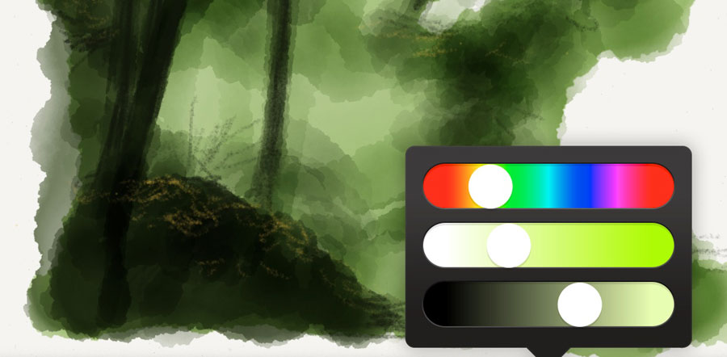

[[notice | ProTip: background cleanup
| Fill the pencil with a color that matches the background and use it to refine the tree's outline, cleaning up any watercolor that might have bled.
|
| This technique works great to "erase" any spots in the middle of the tree where the sky might be showing through leaves.

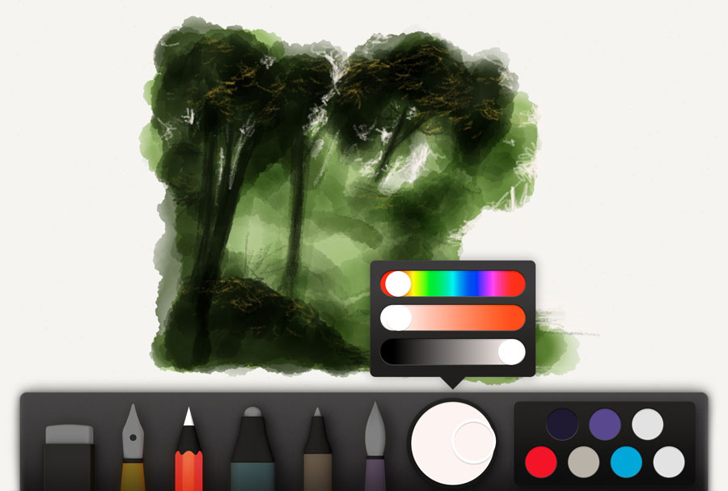

---

## Grass and foliage

When drawing grass, bushes, and other greenery, the same tree techniques can be applied --- with some slight variations.

Instead of painting a base coat with watercolor, I like to use the marker or fountain pen. If done in one stroke (without lifting your pen or finger) you'll get a single continuous color. Otherwise two coats will be required to make this shape smooth because of the translucent nature of these tools.

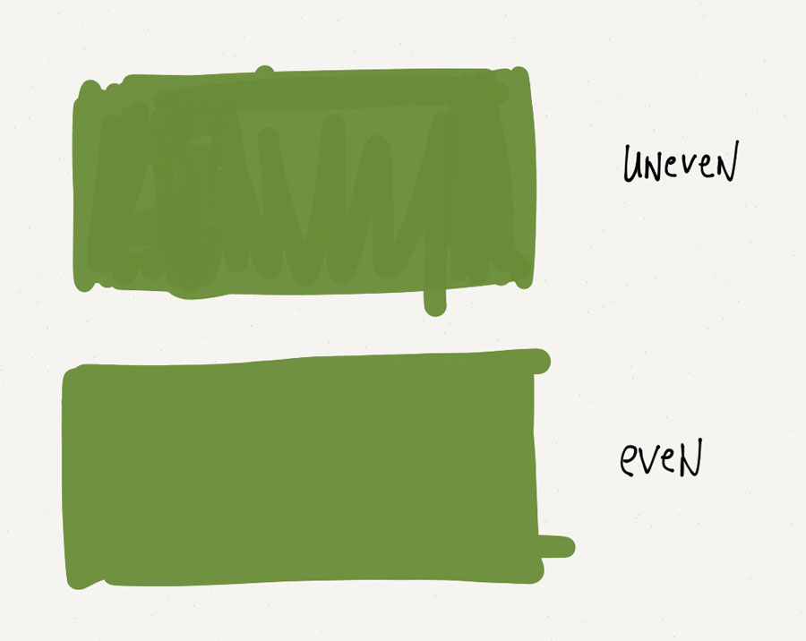

This next step can be tedious, especially if you have a lot of grass to add. To draw each shard of grass, I use green mixed with yellow (pretty much the same highlight color used for trees), and draw small strokes with the pencil. The direction and length of these strokes are important to render realistic looking grass.

Grass cut short is painless to draw. Making small subtle marks with the pencil to suggest grass is all that's needed --- texture is what's important here. 

[[notice | ProTip: treat grass like hair]]
| When drawing longer grass, I like to think of it as hair and block out the major sections with stroke guides. These help determine what direction the rest of the grass should be moving when filling in each chunk.

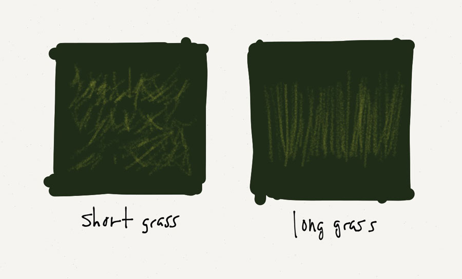

[[notice | ProTip: use stroke speed to your advantage]]
| To feather out each shard of grass, move slow as you begin a stroke and faster as you finish. For those using a Pogo Connect Smart Pen, press hard at the start of your stroke and lighten up as you follow through.

<figure>
  
  <figcaption>
You can create different types of grass by varying their length and direction.
</figcaption>
</figure>

Dark green pencil strokes from the grass's base up to the middle can be used to add shadow to longer grass. For shorter strands, well placed marks below highlight strokes will add an amount of depth.

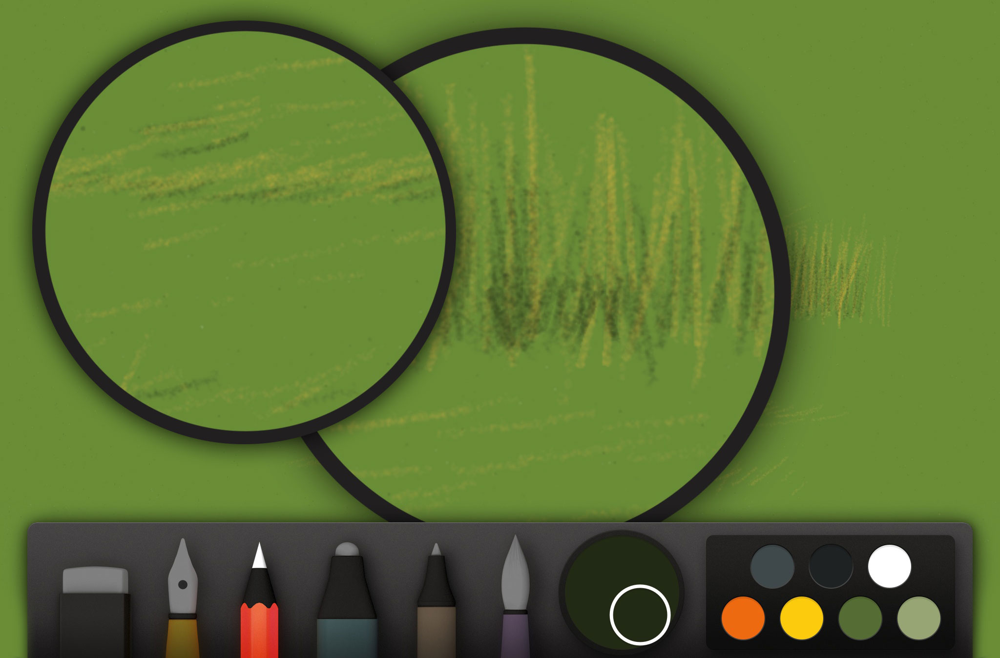

One final tip for creating depth is to paint over everything with light gray or tan colors. Grass that is furthest back receives more coats of watercolor --- while grass that is in the foreground gets less.

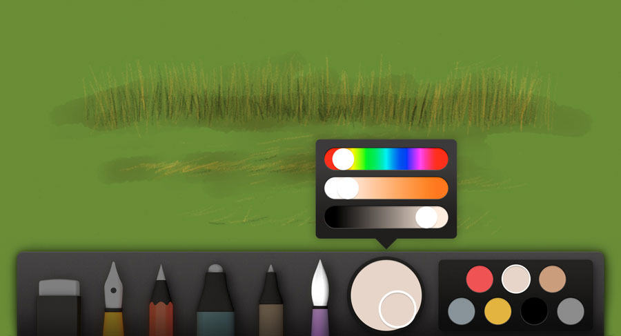

[[notice | ProTip: cool and warm colors]]
| A general rule of thumb is to mix blue/gray to your background colors, and warm them up as you move forward. A couple of well placed pencil strokes using this principle can enhance a composition's depth quite effectively.
|
| 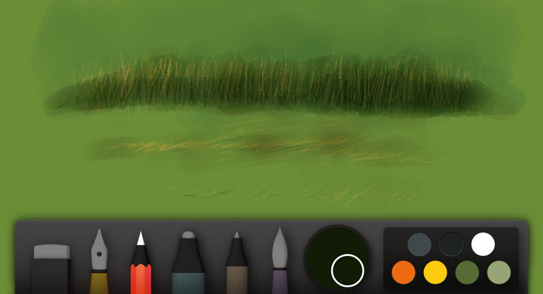

## Variations on a theme

Using all of these techniques on their own or in concert, I was able to create lush backgrounds for many of the portraits in my [PaperFaces Project](/paperfaces/). Below are a few tree and grass examples to show what is possible just by varying the color and composition.

<ul class="gallery-thumbnails">
  <li></li>
  <li></li>
  <li></li>
  <li></li>
  <li></li>
  <li></li>
  <li></li>
  <li></li>
</ul>

---

In the next article in this series I'll take you through the techniques and steps I use to paint a blue skies, fluffy clouds, and sunsets. All three are the perfect compliments to a well drawn tree...
