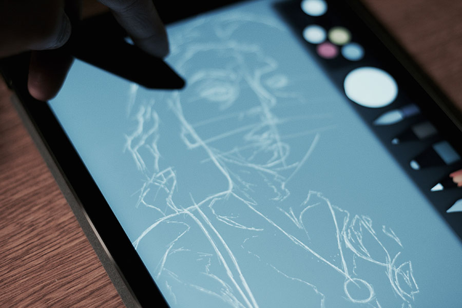
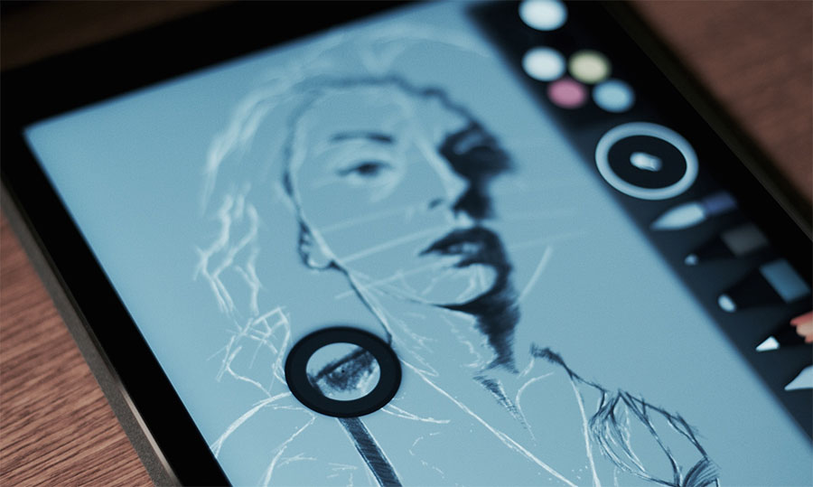
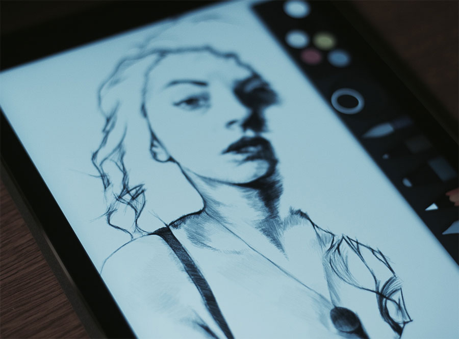
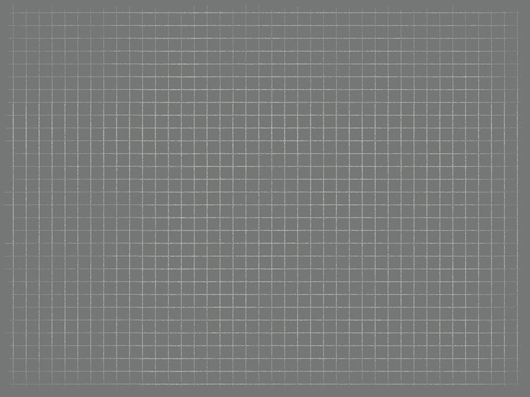

Up until recently I would painstakingly erase and Blend away lines until I got them just right when drawing with Paper by FiftyThree.

When [version 2.2](http://news.fiftythree.com/post/104844221313/paper-update-2-2-holiday-bonus-edition-happy) was released this past December, along with it came a Color Picker and a way to swap page colors whenever you wanted. Using these new features and a carefully mixed color, I'm going to show you how a "faux" layer can help with sketching and tracing.

## Replicating the background color

Have you noticed that the default page color in **Paper by FiftyThree** isn't a pure white? If you haven't here's a quick comparison between the two that makes the difference obvious.

The key to the "faux" layer trick is matching the color you sketch with exactly to the default background color.

<figure>
  
  <figcaption>
Default background color mix: <strong>48</strong>/<strong>2</strong>/<strong>96</strong>
</figcaption>
</figure>

There's two ways of getting this color into your Paper palette:

1. Use the [Color Picker](/mastering-paper/color-picker/) eyedropper to sample an empty spot on the canvas.
2. Tap the small circle inside of the [Color Mixer](/mastering-paper/introduction-tool-guide/#color-mixer) and adjust the 3 sliders to have the following values (48/2/96).

Whichever way you end up choosing I suggest you drag this newly mixed off-white color to an open slot in one of your palettes --- for safe keeping of course.

## Setting the background

If you were to start sketching now it would look like you weren't drawing anything at all. To make these off-white lines more visible, we need to fill in the background with a contrasting color. In this example I went with a gray, but you can choose whatever color you want (we'll delete it later so don't agonize over the perfect color selection).

To fill in the background, simply drag a swatch from one of your palettes (or the [Color Mixer](/mastering-paper/introduction-tool-guide/#color-mixer)) onto the canvas. When done correctly it should fill in the entire background leaving you with something like this:

## Sketching with white

Now the fun begins! Select the off-white color you sampled/mixed earlier and begin sketching.

As you sketch don't worry about whether your strokes are perfect, they won't be part of the finished drawing so be loose and free with them.

[[notice | ProTip: sketch with the pencil tool]]
| To yield the best results with the "faux" layer technique I suggest using the pencil tool. It blends into the default page color better than the harsh edges produced by the ink tools.

## Tracing your drawing

Select a darker color to trace over the white sketch with.

Once you get the general composition of your drawing locked down you'll want to change the color to something darker. Depending on the background color you initially filled the canvas with you may need to adjust it so these new strokes show up.

Using the rough sketch as a guide trace over the white lines with a tool and color of your choice. I used a single color for my tracing but if you happen to change your color as you work it may be necessary to alter the background. You'll know this is the case when your tracing blends into the background making it difficult to tell if you're laying down a mark.

<figure>
  
  <figcaption>
Continue tracing your white sketch and add shadows and other details as you desire.
</figcaption>
</figure>

In the example above I took the tracing one step further by adding dark shadows using a [cross-hatching technique](/mastering-paper/basics/#ink-techniques). This step is completely optional, you really just want to establish enough contours and values to "inform" the drawing.

## Erasing the faux layer

Tap and hold on the Eraser tool and then select **Clear Page Color**.

Once you're happy with things the next step is to remove all of the white lines. If you tap and hold on the Eraser tool for 2 seconds you'll be given the option to **Clear Ink** or **Clear Page Color**. 

Tap **Clear Page Color** and watch as the background and rough sketch disappear, leaving behind a pristinely traced image.

Now you can continue adding to page by drawing and painting on top of what remains. I think you'll find this method is so much faster than having to carefully [erase or Blend away lines](/mastering-paper/erasing/) from an "under-drawing."

<figure>
  
  <figcaption>
Here is how the faux layer trick for Paper by FiftyThree looks in sequence.
</figcaption>
</figure>

## Other uses

Because I mostly do portrait work it never crossed my mind that this technique could have other applications.

https://twitter.com/RonJeffries/status/587650836018438144

I think Ron is onto something and brings up a great use for the faux layer method. In a previous Mastering Paper tutorial I showed how [using grids](/mastering-paper/grid-method/) could help a beginner draw more accurately. Creating a grid comprised of off-white lines would sure make hiding them a breeze don't you think?

So with that in mind here's a [grid template](https://mix.fiftythree.com/11098-Michael-Rose/2854744) I shared on Mix. Save it to your Paper journal, remix your own variations for others to build off of, or share what you created with it on Mix or in the comments below.
