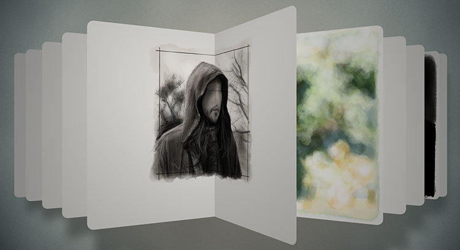
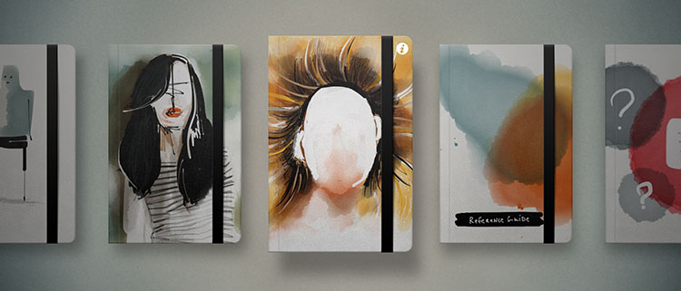
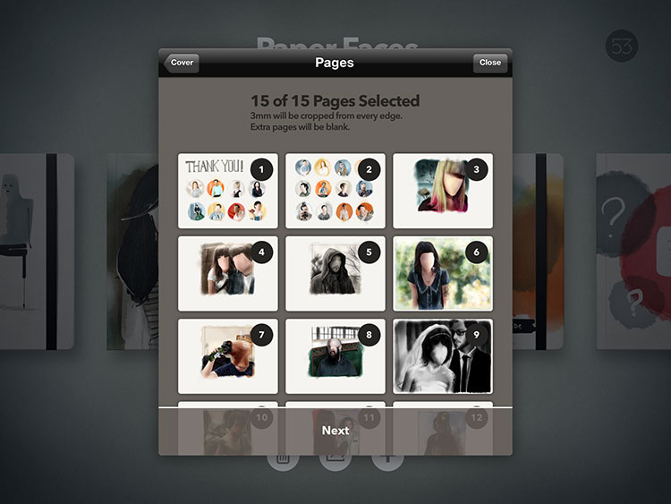
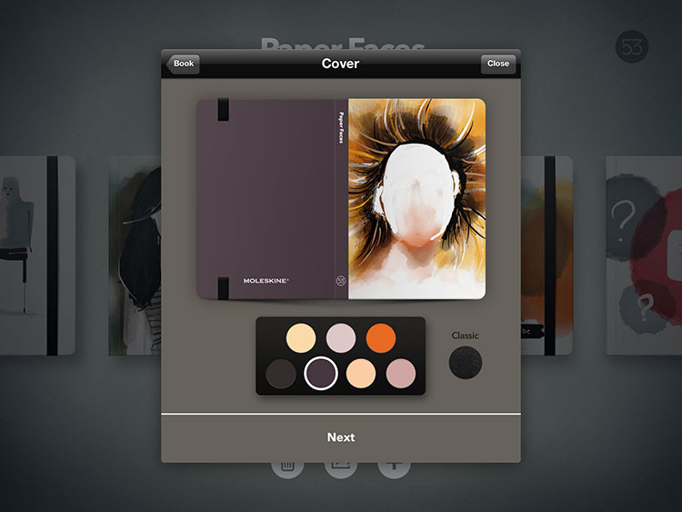
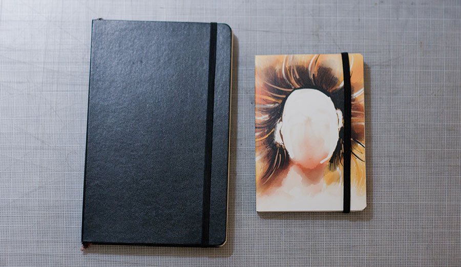
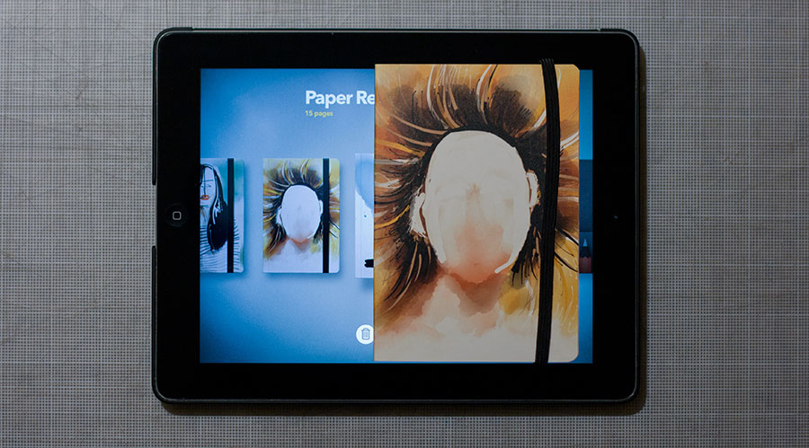

About a month ago FiftyThree added a highly requested feature to their award winning app Paper --- the ability to print a book. Being a graphic designer I was curious to see the quality of these custom printed Moleskine books first hand. Using a small sampling of my PaperFaces portraits I ordered[^book-disclosure] my first book two weeks ago along with a Mastering Paper book I'm still waiting on.

[^book-disclosure]: In the spirit of full disclosure --- I was reimbursed the cost of two Books (plus shipping) created with Paper in exchange for sharing them through a short video and photographs. I was not compensated in any other way and all opinions and bad grammar are my own.

## Journal to custom printed book

Before I get into my impressions of the physical books, I wanted to quickly discuss the book making process. As expected it was utilitarian in design and fully integrated into the iOS app. The only problem I had was whittling down hundreds of [PaperFaces portraits](/paperfaces/) into a collection of 15 favorites to make up my book.





If you haven't watched any of the [Book videos](https://vimeo.com/75045142) or seen this [lovely set of drawings](http://madewithpaper.fiftythree.com/post/64391384887/how-to-make-a-book-earlier-this-month-we) describing how to make a Book in 5 steps, then here's how the process unfolds --- pun intended.

### Select your journal

Taking a few of my favorite [**PaperFaces**](/paperfaces/) portraits and consolidating them down into a smaller journal became the basis of my first Paper book. I'm still waiting on the second book to arrive that features some unpublished [**Mastering Paper**](/mastering-paper/) cheat sheets from upcoming tutorials…





### Choose fifteen pages

As noted earlier, I struggled with selecting 15 pages to turn into a book. I suppose when you have over 550 pages of portraits, narrowing them down to 15 is no easy feat. Maybe next time I'll organize them all into 40 volumes[^40-volumes] and print my own encyclopedia set of PaperFaces to line a bookshelf.

[^40-volumes]: I better start saving my pennies because it would cost me around $1,600 to produce 40 Books with Paper.





[[notice | Maximum page count]]
| It's worth noting that if you select less than 15 pages for your book, you'll receive blanks filling the balance. Something I'd like to eventually see would be the option to create books with a higher page count. Maybe at larger predefined increments to keep the spine size fixed as not to mess with the cover's alignment and wrap. Printing pages ala cart would be nice as well.

### Cover image

I think the best option is to go fully custom with a cover. What I did was create a sketch for each of my books, and then assign them as journal covers. When you choose to *Print a Book* from the share button, Paper pulls in this cover by default. You also have the option of selecting a black leather texture that mimics the Classic Moleskine notebook.





[[notice | ProTip: custom colored cover wraps]]
| The custom option affords you the opportunity of selecting a color for the back cover and spine. As far as I can tell you can't use the color mixer here to pick a color, so be sure to save one in your custom palettes if you don't like the defaults.

### Order the book

If you don't have an account you'll be prompted to create one and then verify via a link sent to your email. The ordering process is what you'd expect if you've ever shopped online before --- enter your name, shipping and billing addresses, and payment information. 

After ordering you can easily check a book's status by tapping **Order Status** from within the *Print a Book* option. Doing so opens a tab in Safari displaying your order number, status, and shipping method. I would assume selecting one of the expedited options provides you with a tracking number for the package, but I went with Standard Shipping so I can't verify that.

## Printed book and packaging

Two weeks later your book(s) will arrive in a small cardboard parcel with a pull tab. Tugging on this rips through the protective packaging to reveal a book wrapped in a protective sheet of paper.


 


If you've ever owned a Classic Moleskine notebook a few of the details printed on the inside front cover and first page should be familiar.


 


### Color faithfulness

So the real question is how well have my Paper drawings been reproduced in printed form? Pretty damn good if you ask me. To my eye the color is almost an exact match to what I see on the iPad's screen. It's not as bright because the paper stock printed on is warmer, but for the most part it's faithful.









### Paper quality

The paper stock printed on is thinner than what I was expecting, which is a slight bummer. I suppose it's hard to gauge from the promotional videos alone just how thick they'd be. By no means a deal breaker, but something to be aware of if you were expecting something more.





### Accordion fold

I personally like the accordion fold and how each of the pages are glued together into one continuous strip. If you're using a Book to tell a story in 15 pages, this style of binding helps enhance that. It also mimics the way you interact with pages from within Paper, which is a nice touch.





### Cover and spine

As noted before, the cover isn't as thick as I had hoped for, but it's not super thin either. To further protect it from scratches and stains, I'll be leaving it in the paper sleeve it shipped with. I'm crazy like that…






 


## Justifying the price

Yes, $40 for a 15 page book[^page-cost] is bit on the expensive side. Especially when you can easily print a book from any local drugstore for half the price. But what you won't be getting for that price is a custom, handmade, accordion folded book, all within two weeks time.

Not to mention the finished books share the same 4:3 proportion as your Paper creations so there won't be any funny bleeds or crops. What you see in Paper is what you get in real life, straight down to the elastic band and rounded edges. The fact that these little books come baring the Moleskine name, instantly adds +100 hipster cred points to your work.

[^page-cost]: Not including shipping costs a Paper Book ends up costing about $2.67 per page.









If you've been holding out printing a book with Paper, I'd encourage you to give it a try at least once. I believe they're most effective as gifts to share with friends and family. Why not get a jump on the upcoming holiday season and create a book now. If they're as popular as I predict them to be, it might be a good idea to get an order in early to beat the rush.





---

## Mastering Paper reference book

When my second book didn't show up at the same time as the PaperFaces one, I started to worry that it was lost in the mail. I had ordered them at the same time and received shipping notices within seconds of each other notifying me they were on the way. But all is well and the other book finally showed up.

For this book I took a few of my Paper "cheat sheets" and adapted drawings from my **Mastering Paper** series to fill all 15 pages. If you look closely you'll notice a few teases from upcoming tutorials I'm in the process of writing now. I've also embedded a video flip-through for your viewing pleasure.


       





