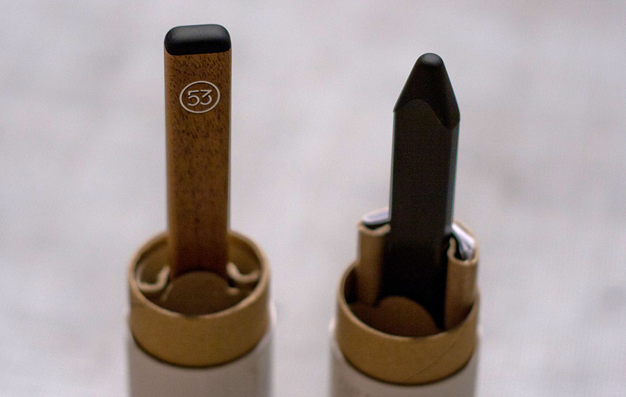
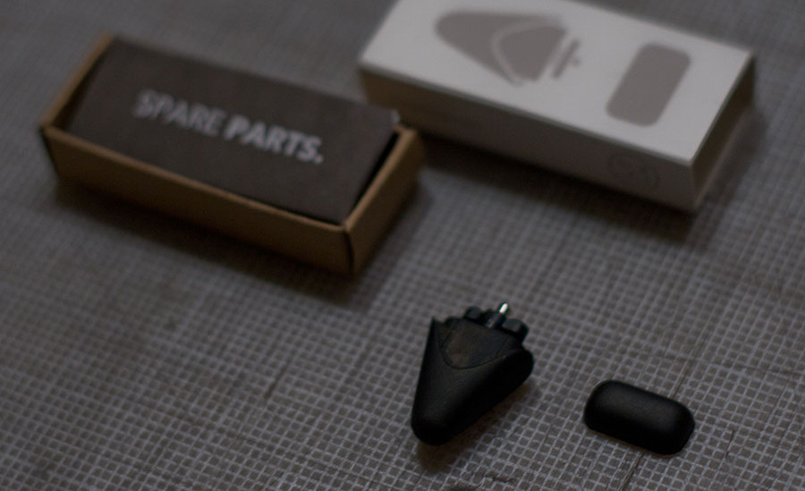
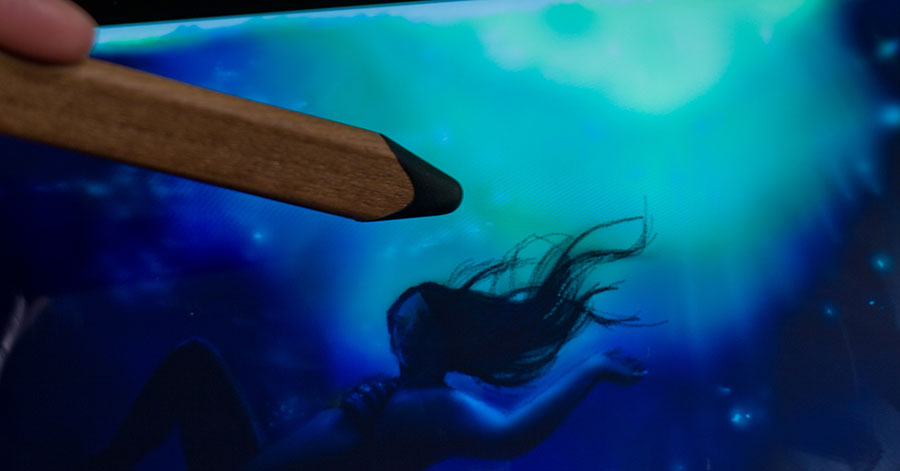
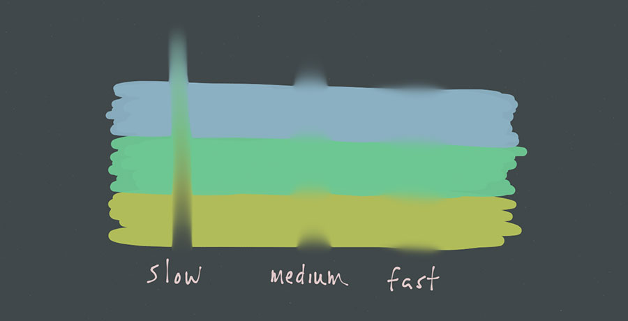
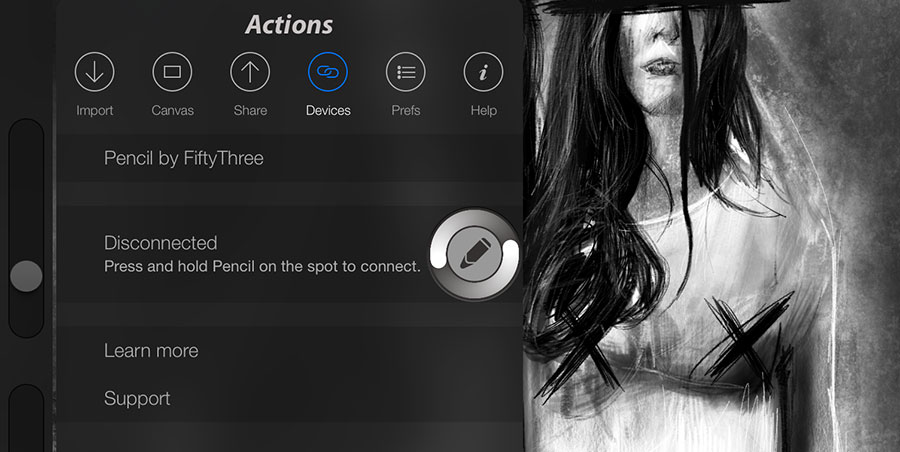

For the last year I've been using FiftyThree's [first hardware product](/mastering-paper/pencil-53-review/), **Pencil**. A Bluetooth stylus that was designed to work seamlessly with Paper for iPad by delivering an experience that feels closer to "the real thing" than any other styli.

## Look and feel

The *Walnut* and *Graphite* finishes both look beautiful. If pressed to pick a favorite, I would probably choose Graphite, just because it feels heavier and more solid to me. But there is something nostalgic and comforting about Walnut's wooden texture that makes it a close second.

If you haven't noticed, Pencil is flat like a [carpenter pencil](http://en.wikipedia.org/wiki/Carpenter_pencil), which keeps it from rolling about and getting lost[^magnet]. Because of the wide and flat shape, I did find it uncomfortable to hold at first. Although after a few drawing sessions it wasn't a concern as my hand adapted to the contour of Pencil.

[^magnet]: The Walnut model has a built in clip that allows it to stick to an iPad Smart Cover magnetically --- magnets, how do they work? Cool party trick but not something I don't use all that often.

Between the two finishes, Walnut is lighter and softer to the touch with a wood texture allowing for more grip. Because of Graphite's slick finish I occasionally had to readjust how I held it. When trying to fill in large continuous tones of watercolor I noticed it slipping the most. Slightly annoying sure, but not a deal breaker by any means.

Similar to Paper, Pencil shares the same minimally designed aesthetic --- that means no buttons, no battery indicator lights[^led-light], and no on/off switches.

I love how the UI in Paper doesn't get in your way, and it's refreshing that Pencil's design echoes this theme. Common tasks like erasing or [blending](/mastering-paper/pencil-first-look/) become more natural, without the need to open the tool tray or press buttons.

Want to erase something? Flip Pencil upside down and erase a mistake like you would "in real life." Need to soften pencil strokes? Use your finger to smudge the pixels. 

<figure>
  
  <figcaption>
So I lied. There is one LED light hidden inside, only visible when charging Pencil via USB.
</figcaption>
</figure>

[^led-light]: A LED light does exist, but it is not visible during normal use. When the battery is plugged into a USB port an amber light can be observed as it charges. If you do need to check how much charge is left on your Pencil you can find them under **Settings > Pencil** in the Paper app along with a Serial Number and Firmware Version.

## Just the tip

To be honest I was a little disappointed when I discovered Pencil's tip wouldn't be pressure sensitive like the one in a [Pogo Connect](/mastering-paper/pogo-connect-smart-pen/). It took some time but with the recent addition of **Surface Pressure** to Pencil + Paper, my desire to use a Pogo Connect has vanished.

The tip is responsive and as accurate as one can expect from the limitations the iPad's digitizer imposes on stylus makers. Wedge shaped, offering a slightly finer point than the rubber nibs found on AluPens, Bamboos, and their capacitive tipped peers.

Pencil's tip does a great job of repelling any finger grease that may accumulate on the iPad's screen --- unlike some cheap styli that simply push it around obscuring your drawing.

When Pencil by FiftyThree originally launched drawing with the broadside of the tip had zero affect on the marks you made. That all changed in iOS 8 and Paper 2.0.

### Is the tip durable?

Pencil's tip is by no means the most durable I've used. The longevity of the rubber that encases the 14kt gold plated tip is affected by the amount of pressure you apply and how held.

Press hard as you draw or use the tip's point more and you're going to wear it out faster. I've had tips begin to show signs of tearing in under 5 hours and others last much longer.

These numbers are relative to the user, which makes locking in a specific number hard. Using the longer side of the tip without a doubt prolongs its age. I suggest to use that whenever filling in larger areas of color

Even if you do manage to tear through the rubber, the tips are still usable, albeit with some black streaking[^streaking] across the screen.

[[notice | Replacement tips]]
| The good news is FiftyThree now offers replacement tips and erasers [in their shop](http://shop.fiftythree.com/). For $7.95 USD (+ shipping) you get two tips and an eraser for Pencil, which isn't too bad if you do a lot of drawing like me.

[^streaking]: Black rubber streaking from the tip taring can be cleaned off the iPad's screen by wiping with a microfiber cloth.

## Will it blend?

For me [Blend](/mastering-paper/pencil-first-look/) is the most exciting thing about Pencil. Sure a ton of other *art* apps have smudging and blending tools, but they all break the creative flow in their implementations.

FiftyThree has made this valuable tool fun and more true to *real* drawing by allowing you to switch between smudging and drawing in a fluid and natural way.

If you take the time to experiment with Blend I think you'll [find it fairly sophisticated](http://making.fiftythree.com/the-precision-behind-blend/). Moving your finger slowly allows the pixels beneath to be pulled and pushed around like finger-paints. Moving your finger fast over an area slightly blurs which I've found useful in creating [depth of field effects](/mastering-paper/pencil-first-look/) and simulating a bokeh.

### Constant pressure is the key

If you're soft with the amount of pressure you apply to the tip while drawing, Blend may trigger inadvertently. The software is  pretty good at figuring out when you want to Blend and corrects itself before blurring something.

But if you're trying to draw lightly to preserve your Pencil tips then you and *Mr. Rewind* are going to become close friends because of this.

[[notice | Pencil tip spring]]
| I'm curious to learn about the experiences of others using Pencil and Blend. As I've broken the tips in, there's loss of springiness when pressing down, which appears to decrease Pencil's sensitivity --- causing smudges mid-stroke.
|
| Not sure if this is a common occurrence or a symptom of me pressing too hard on the tip. Let me know your observations below in the comments section.

## What about the eraser?

I'm not one for erasing all that much and instead rely heavily on the **Rewind** gesture to undo mistakes. But for those of you who use the eraser tool often, you're going to love Pencil.

Instead of opening the tool tray, selecting the eraser, removing your mistake, and going back to a drawing tool --- you now can flip Pencil on its head and erase instantly.

In combination with **Surface Pressure** you can get into tight spots with ease --- something that is impossible to do without Pencil.

<figure class="two-column">
  
  
  <figcaption>
Comparison of erasing positions with Pencil.
</figcaption>
</figure>

[[notice | Erasing and undoing techniques]]
| If you're looking for more erasing techniques you're in luck. I wrote an entire guide dedicated to [correcting and covering-up mistakes](/mastering-paper/erasing/).

## Palm resters of the world rejoice

Back in art school I trained my wrists to avoid resting on the canvas so I wouldn't smudge my work as I drew. For those new to using an iPad stylus --- resting your palms on the screen usually feels more natural.

The problem is, most apps don't do a good job of discerning between those resting touches and the ones being made with your stylus or finger. I'm happy to say FiftyThree delivers on the following promise:

> Rest your hand on the screen, write from any angle. No calibration or setup.

In my tests I had no issues drawing with palms resting on the iPad's screen. All gestures worked fine without causing stray marks: opening the zoom loupe, rewinding mistakes, flipping through pages, and closing the tool tray.

## App compatibility

FiftyThree has made available a [SDK for Pencil](http://www.fiftythree.com/sdk) that other apps[^sdk-apps] can take advantage of. The first app to use the SDK was [**Procreate**](https://procreate.art/), which happens to be my second in command behind Paper. The current version of Procreate supports the same features as Paper except Surface Pressure.

Palm rejection works to eliminate stray marks, but I did notice that it will sometimes rotate the canvas by mistake. Both smudging and erasing worked flawlessly for me.

[^sdk-apps]: The following iOS apps are compatible with Pencil's unique set of features: [Procreate](https://apps.apple.com/us/app/procreate/id425073498?ign-mpt=uo%3D4), [Noteshelf](https://itunes.apple.com/us/app/noteshelf-notes-pdf/id392188745?mt=8&at=1l3v9Qw&ct=sdk-noteshelf), and Squiggle (coming soon).

## Final thoughts on Pencil

I'm interested to see where FiftyThree continues to take Pencil as it and Paper evolve. I'd like to see Blend get some love and offer even more variation in the way that it smudges. So many possibilities...

If you're a casual doodler looking for a well built stylus that mimics traditional drawing utensils and have a need for palm rejection, then Pencil should be your number one choice. On the other hand if you're a pro-user who relies on pressure sensitivity to work in other iOS apps, you may be left wanting more.

## Additional resources

- [Mastering Pencil by FiftyThree Guide](/mastering-paper/pencil/)
- [My iPad stylus recommendations](/faqs/stylus-recommendations/)

## Questions

Want to know more about Pencil or the new features it enables --- ask away in the comments below and I'll do my best to answer.

`youtube: https://www.youtube.com/watch?v=K2dgaV9_rCI`

<small>Post contains affiliate and/or referral links. For more details read my <a href="/terms/#disclosure-policy">disclosure policy</a>.</small>
