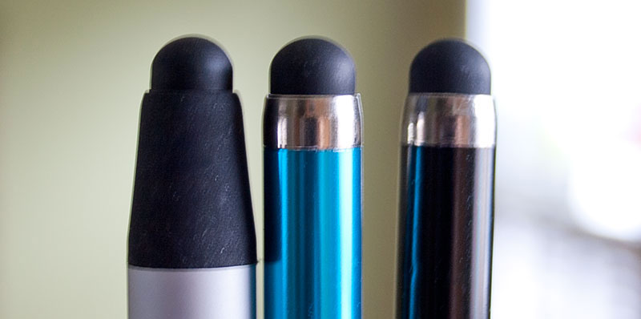
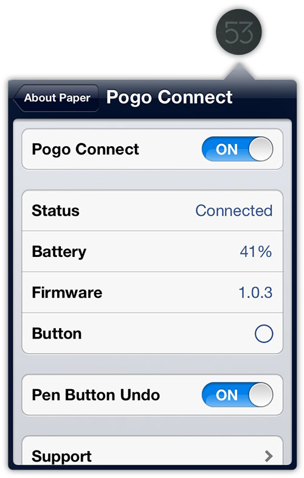
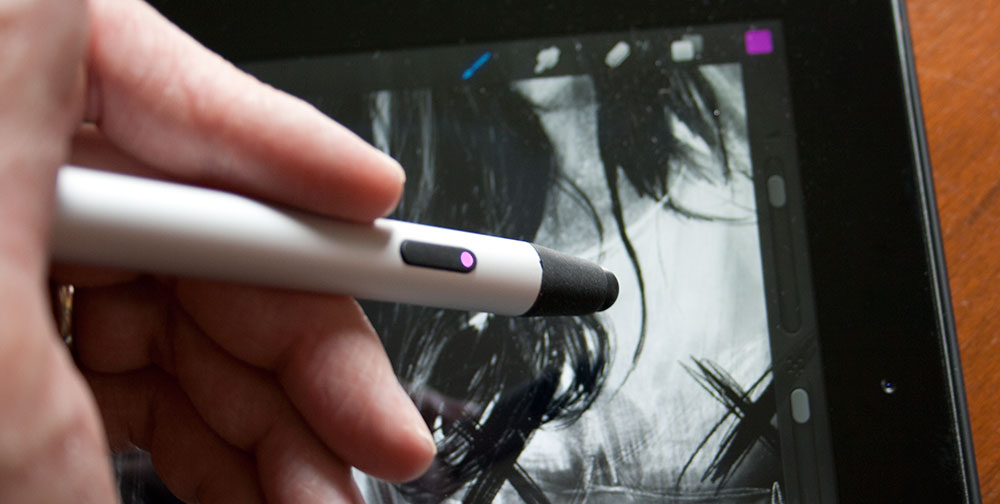
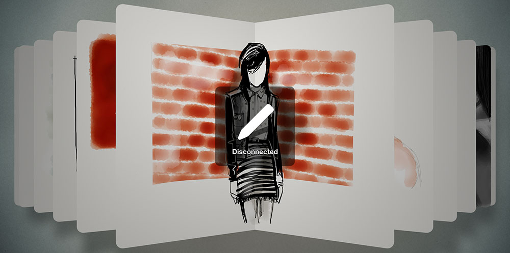
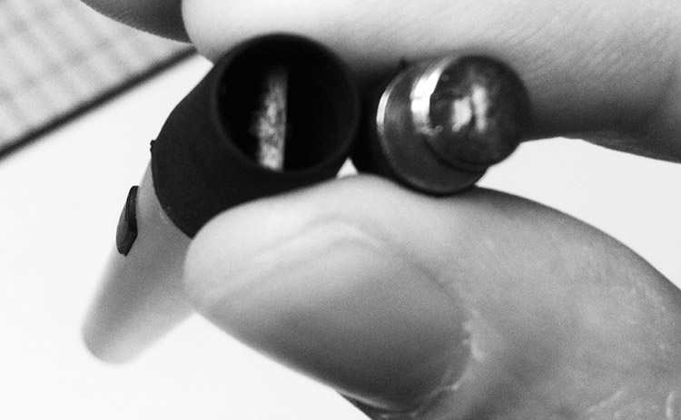
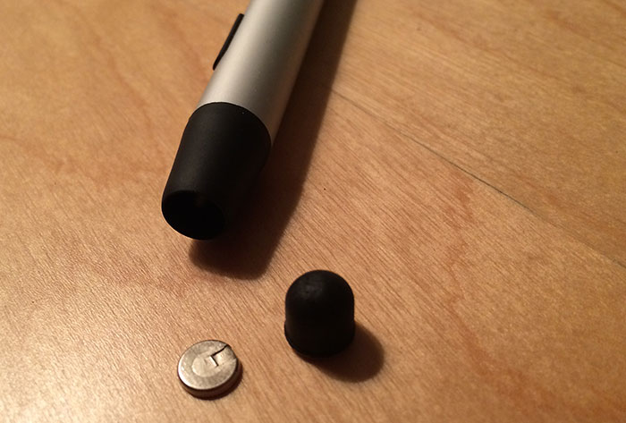

I've been lusting over the promise of pressure sensitive drawing on an iPad ever since I first read about the [Pogo Connect Smart Pen]( https://amzn.to/2ZUufAi)[^pogo-compatibility]. Released back in January for around $80, I held off buying one until the price dropped. Waiting turned out to be smart since my favorite iOS app [**Paper by FiftyThree**](/tag/paper-by-53)[^pogo-paper] also received updates to better support the Pogo Connect.

[^pogo-paper]: As of version 2.5 FiftyThree has dropped support for the Pogo Connect Smart Pen.

[^pogo-compatibility]: Since publishing this review, Apple released the iPad Mini and iPad Air --- both have some compatibility issues with a Pogo Connect Smart Pen. There's something about these new screens that cause the Pogo to not function properly. The iPad Air it doesn't work at all. The iPad Mini has better support, but a few of the new tips don't work. For the full story check out [Ten One Design's website](https://tenonedesign.com/connect).

For my birthday [my wife](https://2littlerosebuds.com "2 Little Rosebuds") picked me up one and I started the process of learning all its nuances. I've gotten adept at using a [LunaTik Alloy Touch Pen](https://amzn.to/2O2HIi7) by drawing with it every day for the last 9 months, but the tip is starting to show signs of tearing --- perfect time to try something new.

## Pogo Connect Smart Pen vs. normal styluses

If you like how rubber nibbed tips feel when drawing you'll be at home with the Pogo Connect.

How does the Pogo Connect's feel compare to other styluses? In your hand it doesn't have the same solidness as the LunaTik or an [AluPen](https://amzn.to/2LuTZKN). By no means is it cheap feeling, but it doesn't have the heft as those other two pens.

The tip isn't any more accurate than your average rubber nub stylus, so if you're looking for precision look at the [Adonit Jot Touch 4](https://amzn.to/2ZUusDA) line[^adonit-touch] instead.

[^adonit-touch]: At the time of writing this review the Adonit Jot Touch 4 is not supported by Paper. If you were hoping to take advantage of the palm detection and pressure sensitive features you'll need to use a different app --- here's the full list of [Jot ready apps](https://www.adonit.net/jot-ready-apps/).

## Setting it up is a breeze

The Pogo Connect comes with a name brand AAA battery to get you up and running right away. I've been drawing with it every day for over a month and I have around 60% of battery life remaining --- not bad at all. To pair with your iPad, open up Paper by 53 ([or one of the supported apps](https://www.tenonedesign.com/connect.php)) and press the button near the tip. After a few seconds it should connect via Bluetooth and you're good to go.

## Pogo Connect Smart Pen options

Paper by 53 has a dedicated settings panel for the Pogo Connect that you can access from tapping the 53 logo in the upper right corner. Here you can check the stylus' connection status, battery level, firmware, and toggle the pen button undo feature.

There is an option labeled "Button" with a circle that I have no idea what it does or indicates. If anyone knows feel free to chime in below. 

### Procreate niceties

Procreate has similar options, along with a cool feature that Paper by 53 doesn't --- the LED light on the Pogo will match whatever color you select in the picker. Not really a useful feature when drawing and painting, but still kind of cool.

## Is the Pogo Connect better for drawing?

I suppose you want to know if the Pogo Connect lives up to the hype. In my opinion, yes --- yes it does. 

The pencil and watercolor tools in Paper by 53 have always been great at feeling and reacting like the real thing. When used with a Pogo Connect these tools are augmented to a point where you can create thick and thin marks with more precision and ease.

Below is a sketch of all Paper's tools using my finger. Each stroke was made by moving my finger slowly at the beginning of each line and progressively getting faster near the end.

This has the effect of making strokes thicker or darker depending on the tools used --- something I probably don't have to tell you if you've used Paper for any amount of time.

<figure>
  
  <figcaption>
Finger drawn lines with varying speed (slow to fast).
</figcaption>
</figure>

In this next example I drew strokes with the same five tools, but using a Pogo Connect Smart Pen. Instead of varying the speed at which I drew each line, I varied the amount of pressure applied to the tip of the pen. Each stroke began by touching the iPad's screen lightly with increased pressure near the end.

<figure>
  
  <figcaption>
Pogo Connect drawn lines with varying pressure (soft to hard).
</figcaption>
</figure>

If it's not obvious from the sample sketches, the Pogo Connect Smart Pen reacts in the following ways compared to a standard capacitive stylus pen while applying pressure:

* **Pencil:** strokes get darker
* **Fountain pen:** strokes get wider
* **Marker:** strokes get wider
* **Pen:** strokes get slightly wider
* **Watercolor:** strokes get wider
 
The two tools that benefit the most from using a Pogo Connect stylus are the **watercolor brush** and **pencil**. Both tools become more responsive and natural to use --- especially the pencil when used for shading and sketching.

The watercolor brush gets the added benefit of being able to draw thinner strokes than your finger or other styluses can. Which is nice since there is no other way to control brush size.

### On the subject of palm rejection

Seen this one mentioned on other reviews and forums so I figured I'd address it. I've never had a problem with iPad registering random marks while I draw or write. Not sure if I draw in a way that eliminates this, so I don't have a way to judge if the Pogo fixes this.

What I can say is when activated you can't draw with anything except the Pogo. While gestures like pinch to zoom, rewind, and moving pages around all continue to work.

If you rest your palm on the screen while you draw, things begin to behave erratically. Because of the way multi-touch gestures work in Paper, the palm rejection feature was likely turned off as not to conflict. 

On the other hand, palm rejection works nicely when multi-touch gestures are tutned off in the Procreate app.

## Is it worth the money?

If you're a Paper addict and use watercolor and pencil I think the high price of a Pogo Connect is justified. If you're predominantly an inker then it's probably not worth it. I find controlling the fountain pen to be much harder when using a Pogo Connect because of how sensitive it is. 

This makes drawing smooth lines hard unless you have a steady hand and don't vary the pressure as you draw.

It's worth noting that there appears to be a major design flaw with the internals of the pen (see below). Constant pressure being applied to a soldered circuit board behind the tip, it eventually breaks and ceases to work properly.

I don't know of anyone in the Paper community who has reported this problem. But since it's the only stylus Paper supports with pressure sensitivity you'll have to decide how important that is to you. Buyer beware.

## What's wrong with the Pogo Connect

About those bugs I mentioned earlier. Not sure if they're hardware or software related, but I've experienced a ton of lockups with the Pogo Connect and Paper by 53.

The stylus will randomly disconnect or become unresponsive and I have to force quit the app or remove the AAA battery inside of the Pogo Connect. It tends to become unresponsive when making a bunch of quick strokes, like when I'm [drawing beard whiskers](/paperfaces/josearato-portrait/).

Not a deal breaker because it doesn't happen all the time, but it is an annoyance that interrupts the creative flow.

### Lock screen annoyances

During my first week with the Pogo Connect I encountered another issue that I thought might have been a Paper bug. Out of nowhere the iPad's screen turned off and the lock "chhkk" sounded.

After complaining about it on Tumblr a friend messaged me to say that I needed to turn off the iPad cover lock setting. It never occurred to me that there was a magnet in the tip that could trigger a screen lock when moved near the iPad's outer bezel.

[[notice | Screen locking]]
| Toggling iPad Cover Lock/Unlock to OFF in Settings will stop the Pogo from turning off your screen if you get to close to the edge.
| 

Even with these hiccups I'm still a big fan of the Pogo Connect. Gives me hope that companies like [Ten One Design](https://www.tenonedesign.com) will continue to innovate in this space, giving digital creators tools that are even closer to the real thing.

Who knows, maybe someday Apple will rethink that whole "if you see a stylus they blew it" Steve Job's line of thinking and do something to help nurture this.

## Update two months later

Well that didn't take long. About a month after writing this review and two months of daily drawing, my Pogo Connect gave up the ghost. Out of the blue I was drawing and my strokes stopped registering in Paper. I figured it was a software hiccup and the stylus temporarily lost connectivity, but no.

Removed the rubber tip to find this mess. Like others, the metal contact that is soldered to the internal circuit board broke free rendering the pressure sensitivity useless.

I have an email out to Ten One Design to see what can be done. I've heard they respond quickly with free replacements, which could indicate they're aware of a major design flaw and trying to do right by it.

I don't know if I can continue to recommend the product if it's prone to breaking after a few months. I'll let you know how things go...

## Update a week later

And like that Ten One Design sent me a replacement pen with 2 extra tips free of charge. Excellent customer service if you ask me! Not sure if it's that new car smell effect, but this pen feels more sturdy and responsive than the last.

Hoping that means the build quality has been improved and the tip sensor breaking apart is no longer an issue.

## Update three months later

Feels like **Groundhog Day** all over again. My replacement Pogo didn't fair too well and broke in the exact same way after three months of daily usage. 

Big shout out to Ten One Design's customer service for setting me up with another replacement gratis. I've been told they beefed up the soldering for a new production run in September. Not sure if that will make much of a difference, but will report back after I get my hands on it.

If it wasn't for Paper I probably would have dumped the Pogo and moved to the Adonit Jot Touch and Procreate full time. But there's something magical about Paper that keeps pulling me back...

[[notice | A new iPad stylus]]
| After having a long run with Ten One Design's Pogo Connect stylus I have left it behind. After updating to an iPad Air 2 (which has poor support for the original Pogo Connect) and Paper being updated to include **Surface Pressure**, I've begun using [FiftyThree's Pencil stylus](/mastering-paper/pencil-53-review/) exclusively.
|
| It doesn't vary strokes in the same way as a Pogo Connect (or other pressure sensitive styli), but it produces the same results and has [a few tricks](/mastering-paper/pencil-first-look/) up its sleeve.


