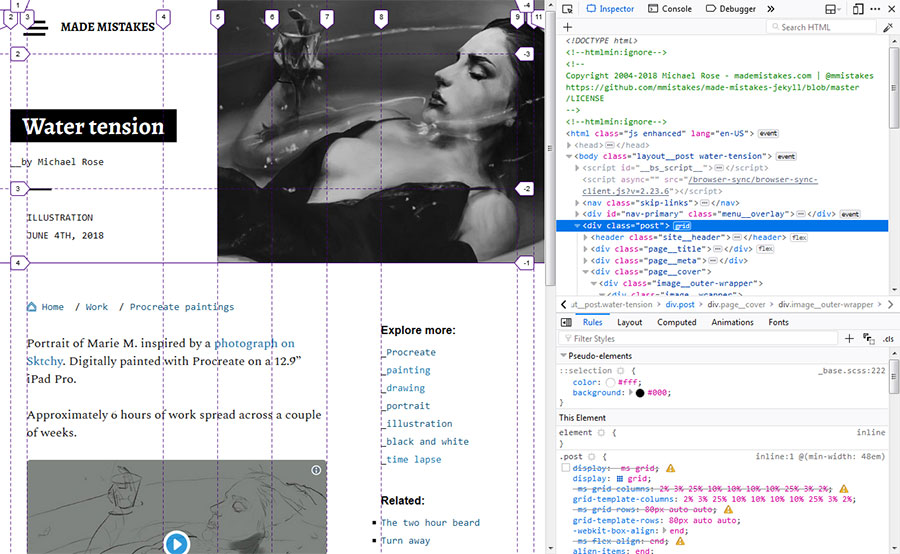
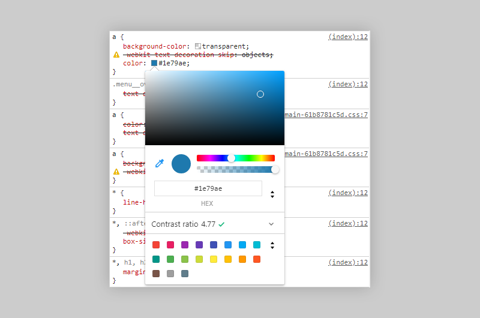
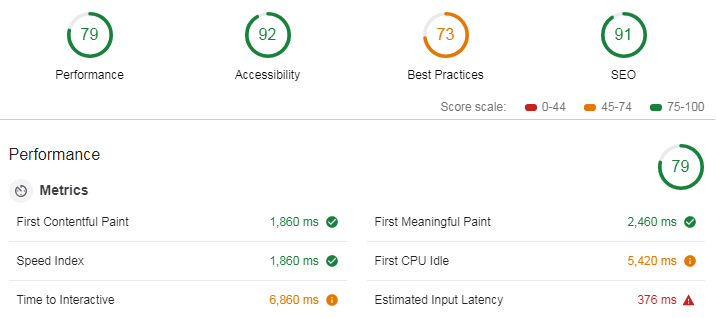
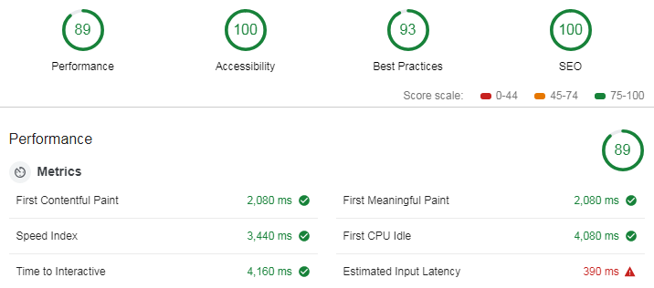

Lately I've been toying with the idea of migrating from [**Jekyll**](https://jekyllrb.com/) to [**GatsbyJS**](https://www.gatsbyjs.org/) (more on that in a future post). Initial tests look promising, but there are [some issues](https://github.com/mmistakes/gatsby-test/issues/1) I'm still working through.

In the meantime I've taken new visual cues I originally built as [React components](https://reactjs.org/docs/react-component.html) in two experimental Gatsby site repos: [gatsby-wordpress-cms](https://github.com/mmistakes/gatsby-wordpress-cms) and [gatsby-test](https://github.com/mmistakes/gatsby-test), and adapted them here as standard HTML/CSS.

## Design changes

In [Made Mistakes v12](https://github.com/mmistakes/made-mistakes-jekyll/releases/tag/12.0.0) text and image where large and readible, but didn't exactly fill the canvas elegantly. I wanted to change that with this design refresh.

<figure>
  <p class="browser-frame">
    
  </p>
  <figcaption>Site design before the refresh.</figcaption>
</figure>

Since majority of the visitors to my site use modern browsers, I had a good excuse to play with `display: grid`. I've removed the [**Susy** mixins](http://oddbird.net/susy/) and most of the `float` based columns, which cut the amount of CSS I had to write considerably.

<figure>
  <p class="browser-frame">
    
  </p>
  <figcaption>Site design after the refresh.</figcaption>
</figure>

To my eye this new layout breaks up the page better. Content comes into view earlier on the page, and there's plenty of room for ancillary information on the right. With a little `position: sticky` sprinkled on the `aside` column, internal skip links stay fixed in view --- when space allows.

[[notice | ProTip: Use the Firefox DevTools when working with CSS grid layouts]]
| 

Out of all the major browsers, Firefox's [**Grid Inspector**](https://developer.mozilla.org/en-US/docs/Tools/Page_Inspector/How_to/Examine_grid_layouts) is argubly the best for examining, modifying, or debugging grid layouts.

## Accessibility improvements

This refresh prompted me to test how accessible the site is and fix any glaring issues.

### Buttons have an accessible name

> When a button doesn't have an accessible name, screen readers announce it as "button", making it unusable for users who rely on screen readers.

Digging in, I discovered [**bigfoot.js**](http://bigfootjs.com/)[^bigfoot] didn't name `<button>` elements that it created. Thankfully the button markup is configurable so I was able replace a set of presentational-only `<svg>` elements with unique names instead.

[^bigfoot]: A jQuery plugin used to make footnotes less visually distracting.

```javascript
var bigfoot = $.bigfoot({
  actionOriginalFN: 'delete',
  buttonMarkup: (
    '<div class="bigfoot-footnote__container">' +
    ' <button href="#" class="bigfoot-footnote__button" rel="footnote"' +
    ' id="{{SUP:data-footnote-backlink-ref}}"' +
    ' data-footnote-number="{{FOOTNOTENUM}}"' +
    ' data-footnote-identifier="{{FOOTNOTEID}}"' +
    ' alt="See Footnote {{FOOTNOTENUM}}"' +
    ' data-bigfoot-footnote="{{FOOTNOTECONTENT}}">' +
    ' <span class="visually-hidden">{{FOOTNOTENUM}}</span>' +
    ' </button>' +
    '</div>'
  )
});
```

### Color contrast is satisfactory

The color of elements like captions and footer text were too light, so I darkened them. I did the same for links by giving them a contrast ratio of `4.77`.





## Performance improvements

Optimizations with the biggest impact (minifying, concatenating, inlining critical CSS) I was already doing, but there was still room for improvement.

### Defer offscreen images

> Consider lazy-loading offscreen and hidden images after all critical resources have finished loading to lower time to interactive.

Large feature images were already lazy-loaded and served responsively using `srcset` and a handful of sized images. Images found in the body `{{ content }}` of my Markdown files were not.

Taking a cue from [**gatsby-remark-images'**](https://github.com/gatsbyjs/gatsby/tree/master/packages/gatsby-remark-images) playbook, I wrote a small plugin to convert Markdown image syntax into an `` element with synatactically sugar for lazy-loading. To my surprise this actually worked.

```ruby
# Description: Jekyll plugin to replace Markdown image syntax with lazy-load HTML markup

Jekyll::Hooks.register :posts, :pre_render do |post, payload|
  docExt = post.extname.tr('.', '')
  # only process Markdown files
  if payload['site']['markdown_ext'].include? docExt
    newContent = post.content.gsub(/(?:!\[(.*?)\]\((.*?)\))/, '<noscript></noscript>')
    post.content = newContent
  end
end
```

### Avoids an excessive DOM size

> Browser engineers recommend pages contain fewer than ~1,500 DOM nodes. The sweet spot is a tree depth < 32 elements and fewer than 60 children/parent element. A large DOM can increase memory usage, cause longer style calculations, and produce costly layout reflows.

Trimming `<div>` fat where I could helped cut page weight down. Some hefty pages remain (I'm looking at your [PaperFaces gallery]({{ '/paperfaces/' | relative_url }})), but most fall under the 1,500 DOM node threshold. In the future I hope to fix this issue with a [gallery pagination component](https://awesome-lewin-0d1356.netlify.com/grid-example/) when switching to Gatsby.

## Lighthouse audits comparison









Not sure why metrics like *Speed Index* increased. But *Time to Interactive*, *First Meaningful Paint*, and *First CPI Idle* all show improvements, so I guess that's why the site went from a 79 in performance, to an 89. :man_shrugging:

## Build and deploy

And if all of this wasn't enough, I also made the switch away from [**Travis CI**](https://travis-ci.org/), to [**Netlify**](https://www.netlify.com/). Instead of a 48 line `.travis.yml` file I now have a three line `netlify.toml`.

The Netlify builds are about 2-4 minutes faster than those with Travis CI. And look to be even quicker if I leverage undocumented [Netlify cache folders](https://www.contentful.com/blog/2018/05/17/faster-static-site-builds-part-one-process-only-what-you-need/#caching-for-the-win) that persists between builds. Using these to store the thousands of images I pipe through resizing tasks could shave another 6-8 minutes off my build.
