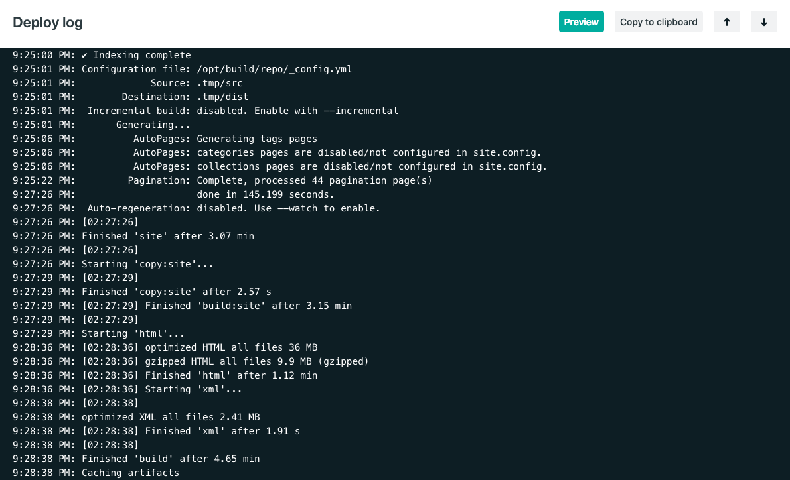

Slowly but surely, I've been chipping away at my site's [build time on **Netlify**](#build-and-deploy).

There's little left for me to optimize until Jekyll drops some nice updates in [version 4.0](https://github.com/jekyll/jekyll/projects/2). I've [cached the rendering of Liquid includes](https://github.com/mmistakes/made-mistakes-jekyll/issues/629) across `_layouts` via the [``](https://github.com/benbalter/jekyll-include-cache) tag, limited use of `` loops over large collections like ``, and [stripped Jekyll's duties down](#optimization) to solely a HTML generator.

The "little" that remains, is about [a gigabyte of images](https://github.com/mmistakes/made-mistakes-images) I pipe through **Gulp**. Thousands of high resolution images are processed by [**Sharp**](https://github.com/lovell/sharp) into various sizes. I've been able to knock this down from 18 minutes, to six on a fresh build...


{: .browser-frame}

When building the site locally I store the image artifacts in a temporary folder, and generate new ones only if the source changes. When Netlify builds the site it processes these images each and every build --- regardless if they have changed or not.

By stashing the processed images in a *secret* Netlify cache folder[^cache-folder] and using [Gulp to move files](https://github.com/mmistakes/made-mistakes-jekyll/tree/master/gulp) around, I cut the build time in half. Which is fantastic since I'm now averaging 5--8 minutes for dependencies to install, Jekyll to run, and Netlify to deploy the site.

[^cache-folder]: Netlify has an undocumented `/opt/build/cache/` folder that is cached and persists between builds. :tophat: [Faster static site builds Part 1](https://www.contentful.com/blog/2018/05/17/faster-static-site-builds-part-one-process-only-what-you-need/#caching-for-the-win)

**Excerpt from my Gulp build task**

```javascript
// 'gulp copy:images:cached' -- copies cached images from Netlify's `/opt/build/cache/` folder to `/dist/`

gulp.task("copy:images:cached", () => {
  return gulp
    .src(paths.imageFilesCachePath + "/**/*")
    .pipe(newer(paths.imageFilesSite))
    .pipe(gulp.dest(paths.imageFilesSite));
});
```
