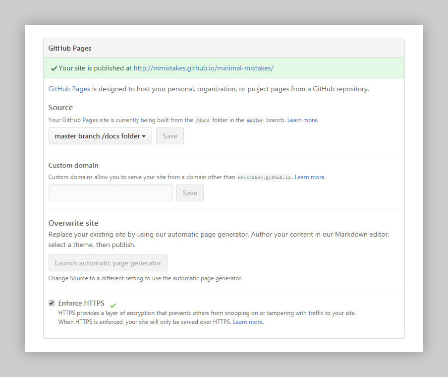

You know what sucks? Maintaining two separate branches of an open source project, just to host its source code and documentation together with GitHub Pages.

For example, my Jekyll theme's are setup on GitHub with the following branches:

- `master` holds the theme files for cloning and installing
- `gh-pages` is a dupe of master with example posts and theme documentation

Anytime I push updates to `master` I switch to the `gh-pages` branch, cherry pick commits, and deal with any conflicts. Wouldn't it be nice if there was a better way to keep everything together in a single branch?

Well there is. Under **Settings** there is a drop-down menu under **GitHub Pages/Source** that allows you to choose where to build from[^sources].

[^sources]: You can [configure GitHub Pages](https://help.github.com/articles/configuring-a-publishing-source-for-github-pages/) to publish your site's source files from `master`, `gh-pages`, or a `/docs` folder on your `master` branch for Project Pages and other Pages sites that meet certain criteria.





Flip the source to **master branch /docs folder**, move contents of `gh-pages` into **/docs** on `master`, and boom :tada:!

Source code and documentation in a single branch. No more switching branches and ":cherries: cherry picking" for me :thumbsup:.
