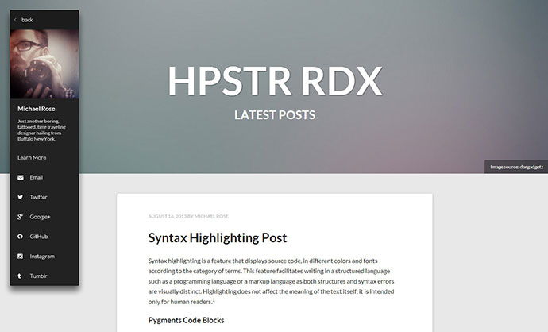

They say three times the charm, so here is another free Jekyll blog theme for you. I've learned a ton since open sourcing my first two themes [on Github](http://github.com/mmistakes), and wanted to try a few new things this time around. If you've used my previous themes most of this should be familiar territory...

## Features

* Responsive layouts. Looks good on mobile, tablets, and desktop devices.
* Full compatibility with [GitHub Pages](http://pages.github.com/).
* Modern and minimal design with a focus on clean typography.
* Support for large images to call out your favorite posts.
* Optional [Disqus](http://disqus.com) comments.
* Support for [Open Graph](https://developers.facebook.com/docs/opengraph/) and [Twitter Cards](https://dev.twitter.com/docs/cards).
* Simple custom 404 page to get you started.
* Support for Pygments and Coderay syntax highlighting to make your code examples look snazzy.
* Grunt and Rake tasks for easier site development.

{: .browser-frame}

  <a href="https://mmistakes.github.io/jekyll-theme-hpstr/theme-setup/" class="btn">Setup guide</a>
  <a href="https://mmistakes.github.io/jekyll-theme-hpstr/" class="btn">Live preview</a>

## What's different with this Jekyll theme?

This time around I wanted to see how much of the "branding"[^2] I could remove and deemphasize to make the content sing in contrast. The primary way I went about doing this was by down playing anything that wasn't part of a post or page's content. Collapsing the blog's navigation behind a drop down was one way I slimmed the header, to get at the content quicker.

On desktops and tablets (horizontal orientation) the menu is placed in the top left corner with `position: fixed`[^3] to remain in view as the page is scrolled. Mild CSS3 animations and transforms were utilized to progressively enhance the [drop down menu](http://tympanus.net/codrops/2013/04/19/responsive-multi-level-menu/) for browsers that support these properties, and gracefully degrades on those that do not. *The menu is also completely usable when JavaScript is disabled.*

Everything that isn't `#main` I view as support content--- living one step down from a post or page in the overall hierarchy. In the case of author bylines, post dates, and social sharing links, I used a light gray color to push these elements back, and pull the main content forward. Related posts and comments are sectioned off just enough from the main to keep them connected but visually separated.

### Grunt build script for development

Up until this point I've mostly used tools like [CodeKit](http://incident57.com/codekit/) and [Prepros](https://prepros.io/) to compile my LESS stylesheets and concatenate scripts. Flirting with Grunt on a few personal projects, I wanted to integrate it into this theme as a build tool for messing with the theme's stylesheets.

For those who are unfamiliar with Grunt I encourage you to check out the [getting started guide](http://gruntjs.com/getting-started). Basically how this works is, you [install Node.js](http://nodejs.org/), [install Grunt](http://gruntjs.com/getting-started) and dependencies by running `npm install`, and then run various Grunt tasks defined in the project's [`Gruntfile.js`](https://github.com/mmistakes/jekyll-theme-hpstr/blob/master/Gruntfile.js) file.

Currently there are two Grunt tasks: one to build and optimize and the other to watch for changes to any LESS and JavaScript files. For now you need to run `grunt` to rebuild the CSS, concatenate JavaScript files, and optimize .jpg, .png, and .svg files in the `images/` folder. And then run `jekyll build` to pull these changes in when developing locally. 

There are some [Jekyll Grunt plugins](https://github.com/dannygarcia/grunt-jekyll) to help make things work more seamless, but I avoided them to keep the theme compatible with GitHub Pages. While not a perfect solution you can run `grunt watch` in combination with `jekyll build --watch` to watch for LESS and JS file updates to be processed by Grunt and auto-generated by Jekyll.

[[notice | Update]]
| Grunt is no longer needed to build `main.css`. I've ported all of the Less stylesheets over to Sass to utilize Jekyll's built-in support for preprocessing .scss files. Updating most colors and fonts is as easy as changing a few values in `_sass/_variables.scss` and running `jekyll build` (or deploying to GitHub if you host there).

### Social sharing links

Instead of using bulky JavaScript widgets provided by Facebook, Twitter, and Google I went with lightweight share links. Social sharing links are enabled by default on all posts and pages. To disable add `share: false` to the post's YAML Front Matter.





[^2]: To me a blog's masthead, logo, title, headline, and navigation are branding elements that can reinforce or distract from a central theme or feeling. I suppose downplaying or removing these elements could be see as a way of branding too… but that's a discussion for another day.
[^3]: On mobile I choose to remove the fixed positioning to keep the menu from interfering with the main content.

## Questions?

Having a problem getting something to work or want to know why I setup something in a certain way? [File a GitHub issue](https://github.com/mmistakes/jekyll-theme-hpstr/issues/new).

## License

This theme is free and open source software, distributed under the [MIT License](https://github.com/mmistakes/jekyll-theme-hpstr/blob/master/LICENSE). So feel free to modify it however you'd like without linking back to me or including a disclaimer.
